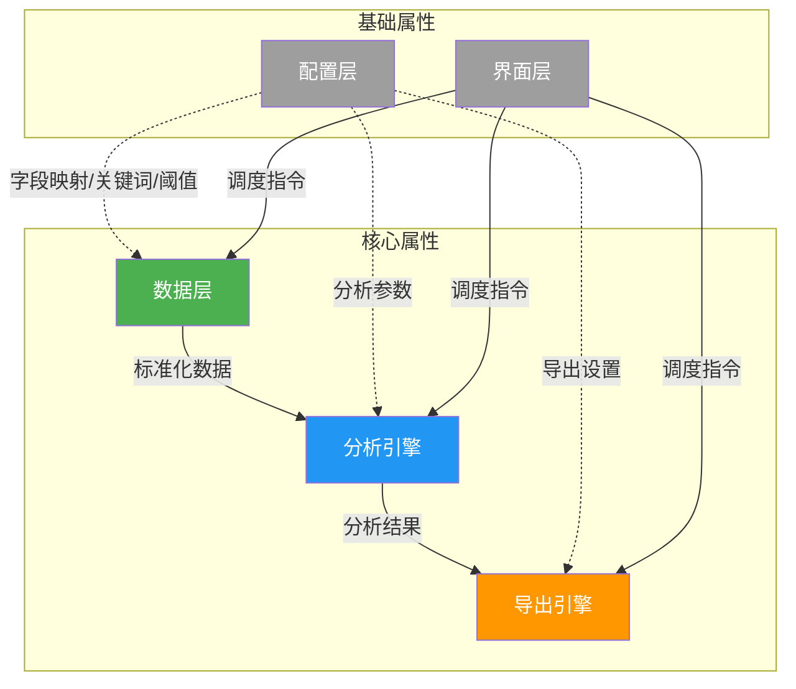

# 多源数据分析系统 - 本质分析

> 分析日期：2026-05-03 | 场景：场景B（开发新项目 - 基于现有项目重构）

---

## 一、是什么（坡度三阶段）

### 阶段1：点出概念

> **一句话定义**：多源数据分析系统是一个"纪委初核分析助手"，将银行、微信、支付宝、话单等原始数据转化为职务犯罪初核所需的线索技术分析报告。

**本质特征**：

| 推导要素 | 逻辑分析 | 结论 |
|---------|---------|------|
| **核心问题** | 纪委监委职务犯罪初核需要从大量原始数据中快速定位可疑线索 | 需要自动化分析工具替代人工筛查 |
| **目标用户** | 纪委监委办案人员 | 非技术背景，需要直观易懂的报告 |
| **核心价值** | 多源数据交叉验证，发现单一数据源无法发现的关联 | 跨数据源关联是核心壁垒 |

**本质特征列表**：
1. **多源整合** - 系统必须同时处理银行、微信、支付宝、话单四类数据
2. **交叉验证** - 系统必须能跨数据源验证人员关联（话单+账单交叉）
3. **智能识别** - 系统必须自动识别存取现、特殊金额、关键交易等模式
4. **专业报告** - 系统必须输出符合纪委监委工作规范的专业分析报告

### 阶段2：建立联系

| 属性名 | 推导来源 | 类型 | 说明 | 深入？ |
|-------|---------|-----|------|-------|
| **数据层** | 多源整合的核心 | 模块 | 四类数据的加载、清洗、标准化 | ✅ 需深入 → [[04-数据层-四层设计]] |
| **分析引擎** | 交叉验证+智能识别 | 模块 | 存取现识别、频率分析、交叉分析、关键交易识别、大额资金追踪、高级分析 | ✅ 需深入 → [[05-分析引擎-四层设计]] |
| **导出引擎** | 专业报告 | 模块 | Excel+Word报告生成 | ✅ 需深入 → [[06-导出引擎-四层设计]] |
| **配置层** | 所有模块的基础设施 | 属性 | 字段映射、关键词、阈值配置 | ❌ 当前文档说明 |
| **界面层** | 用户交互入口 | 属性 | CLI命令行界面 | ❌ 当前文档说明 |

**属性关系图**：

### 阶段3：详细解释

**配置层**：
- **定义**：通过 `config/` 目录管理字段映射、分析参数、导出设置
- **关键点**：
  - `config.json`：主配置，含字段映射、分析参数
  - `keywords.json`：关键词库（存取现、重点收支），从config.json抽取独立
  - `thresholds.json`：阈值配置（大额级别、特殊金额列表等），从config.json抽取独立
  - 字段映射是连接原始数据和统一分析逻辑的桥梁
  - 关键词库是存取现识别和关键交易识别的知识沉淀
  - 配置外置使得业务规则调整不需要改代码

**界面层**：
- **定义**：CLI交互界面，提供数据加载、分析执行、报告导出的菜单驱动操作
- **关键点**：
  - 当前为命令行界面（CLI），重构后保留CLI入口
  - CLI只负责用户交互和流程调度，不包含任何数据处理逻辑
  - 未来可扩展Web界面，通过统一的Application接口层调用

**区分属性（边界）**：
- ✅ 做：银行/微信/支付宝/话单四类数据分析、交叉关联、Excel+Word报告导出
- ❌ 不做：数据采集和取证、实时监控、数据库持久化、多用户权限管理

**设计哲学**：数据驱动、配置外置、分析可追溯、报告专业化

---

## 二、为什么（坡度三阶段）

### 阶段1：点出概念

> **存在理由一句话总结**：纪委监委办案人员面对海量多源数据（银行流水、微信/支付宝账单、通话记录），需要自动化工具完成交叉关联分析并生成专业线索技术分析报告。

### 阶段2：建立联系

| 因果 | 因 | 果 | 逻辑 | 类比 |
|-----|---|---|-----|------|
| **数据量** | 单人银行流水动辄数万行 | 人工筛查不可行 | 规模超限 | 用放大镜看星空 |
| **数据分散** | 银行/微信/支付宝/话单各自独立 | 无法发现跨源关联 | 信息孤岛 | 拼图碎片散落各处 |
| **专业门槛** | 线索分析需要金融+通讯交叉知识 | 办案人员难以全面掌握 | 知识壁垒 | 医生需要化验报告辅助诊断 |
| **效率需求** | 初核有时间压力 | 必须快速定位可疑线索 | 时效性约束 | 120急救需要快速分诊 |

### 阶段3：详细解释

**理论依据**：
- 反腐败工作中，资金流向和通讯记录是两条最核心的线索链条
- 单一数据源只能看到"某人与某人有资金往来"，无法看到"资金往来前后还有通话联系"
- 交叉验证是发现隐蔽关联的关键方法

**重构理由**（为什么要重构而非在原项目上迭代）：

| 问题 | 源码证据 | 推导逻辑 |
|-----|---------|---------|
| **导出器过于庞大** | `excel_exporter.py` 117KB、`word_exporter_new.py` 133KB | 单文件承载过多逻辑，违反单一职责 |
| **分析逻辑散落** | 分析逻辑既在analyzer中又在exporter中 | 分析和导出耦合，难以独立测试和复用 |
| **数据模型配置耦合** | BankDataModel初始化时从config读取30+字段 | 模型与配置紧耦合，难以独立使用 |
| **状态管理混乱** | 分析结果通过dict传递，无统一状态源 | 违反单一状态源原则 |
| **类型定义缺失** | 全部使用dict/DataFrame传递数据 | 缺少数据规矩，运行时才能发现错误 |
| **CLI与业务混合** | CLI中包含数据处理逻辑 | 界面与业务耦合 |

**重构目标**：
1. **解耦导出与分析**：分析结果生成结构化数据对象，导出器只负责格式化输出
2. **统一状态管理**：引入全局状态对象，所有模块通过接口契约读写
3. **类型安全**：使用 Pydantic/Dataclass 定义数据规矩
4. **模块自治**：每个模块内部状态自治，对外暴露统一接口
5. **保持输出一致**：重构后的导出报告必须与现有输出完全一致
