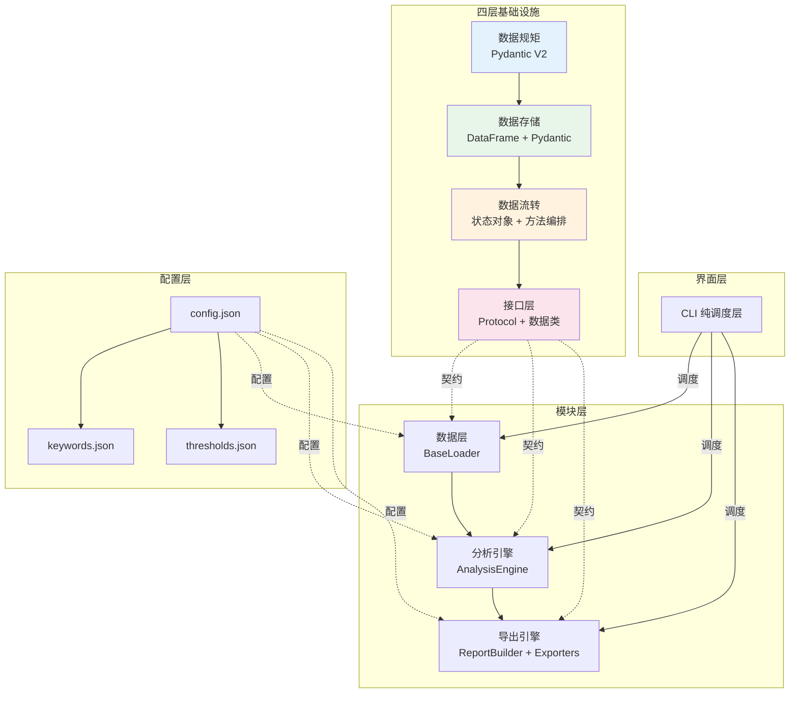

# 多源数据分析系统 - 架构决策

> 分析日期：2026-05-03 | 场景：场景B（开发新项目 - 基于现有项目重构）

---

## 二、为什么（坡度三阶段）

### 阶段1：点出概念

> **存在理由一句话总结**：现有系统功能完整但架构耦合严重，需要基于"数据规矩-存储-流转-接口"四层基础设施重新组织，以实现分析可追溯、导出可替换、配置可外置。

### 阶段2：建立联系

| 决策项 | 现有选择 | 重构选择 | 推导逻辑 |
|-------|---------|---------|---------|
| **架构** | 单体脚本式 | 分层模块化 | 功能复杂度增加，需要清晰边界 |
| **语言** | Python | Python | 生态丰富、数据分析库成熟、团队熟悉 |
| **数据规矩** | dict/DataFrame | Pydantic V2 | 类型安全、自动验证、序列化友好、性能优异 |
| **数据存储** | dict传递 | pandas DataFrame + Pydantic模型 | pandas处理数据，Pydantic定义规矩 |
| **数据流转** | 隐式调用链 | 状态对象 + 方法编排 | 状态流转可追溯，方法职责单一 |
| **接口层** | 无明确接口 | Protocol + 数据类 | 模块间通过接口契约协作，降低耦合 |
| **状态管理** | dict传递 | 全局状态对象 + 模块内部状态 | 单一状态源，可追溯 |
| **配置管理** | 单层json | 分层配置（config + keywords + thresholds） | 灵活部署，安全外置 |
| **导出引擎** | openpyxl + python-docx | openpyxl + python-docx | 保持输出一致性，不换引擎 |
| **CLI** | 自定义CLI混合逻辑 | 保留CLI（纯调度层） | 向后兼容，职责分离 |

**技术架构关系图**：

### 阶段3：详细解释

**架构选择理由**：
- **分层模块化**：数据层 → 分析层 → 导出层，每层职责单一
  - 数据层只管加载和标准化，不管分析
  - 分析层只管计算，不管显示
  - 导出层只管格式化输出，不管计算
- **Pydantic数据规矩**：运行时类型验证 + 自动文档生成，减少配置耦合
- **全局状态对象**：所有模块通过统一状态对象交换数据，可追溯分析过程

**重构不改变的部分**：
- Python语言和pandas数据处理
- openpyxl/python-docx导出引擎
- 分析算法逻辑（存取现识别、频率分析、交叉分析、关键交易识别、大额资金追踪）
- 导出报告的最终内容和格式
- CLI作为用户交互入口

**设计模式选择**：

| 模式 | 应用场景 | 理由 |
|-----|---------|------|
| **策略模式** | 存取现识别、关键交易识别 | 不同识别策略可配置切换 |
| **工厂模式** | 数据模型创建 | 根据数据源类型创建对应模型 |
| **模板方法** | 报告导出 | 统一导出流程，子类实现差异 |

**重构原则**：
1. **输出一致性优先**：重构后的导出报告必须与现有output完全一致
2. **渐进式重构**：先建立新架构骨架，逐步迁移逻辑
3. **分析逻辑不变**：核心分析算法保持原有逻辑，只改变代码组织方式
4. **配置兼容**：config.json格式保持向后兼容
5. **先分析后导出**：分析结果生成结构化数据对象，导出器只负责格式化
