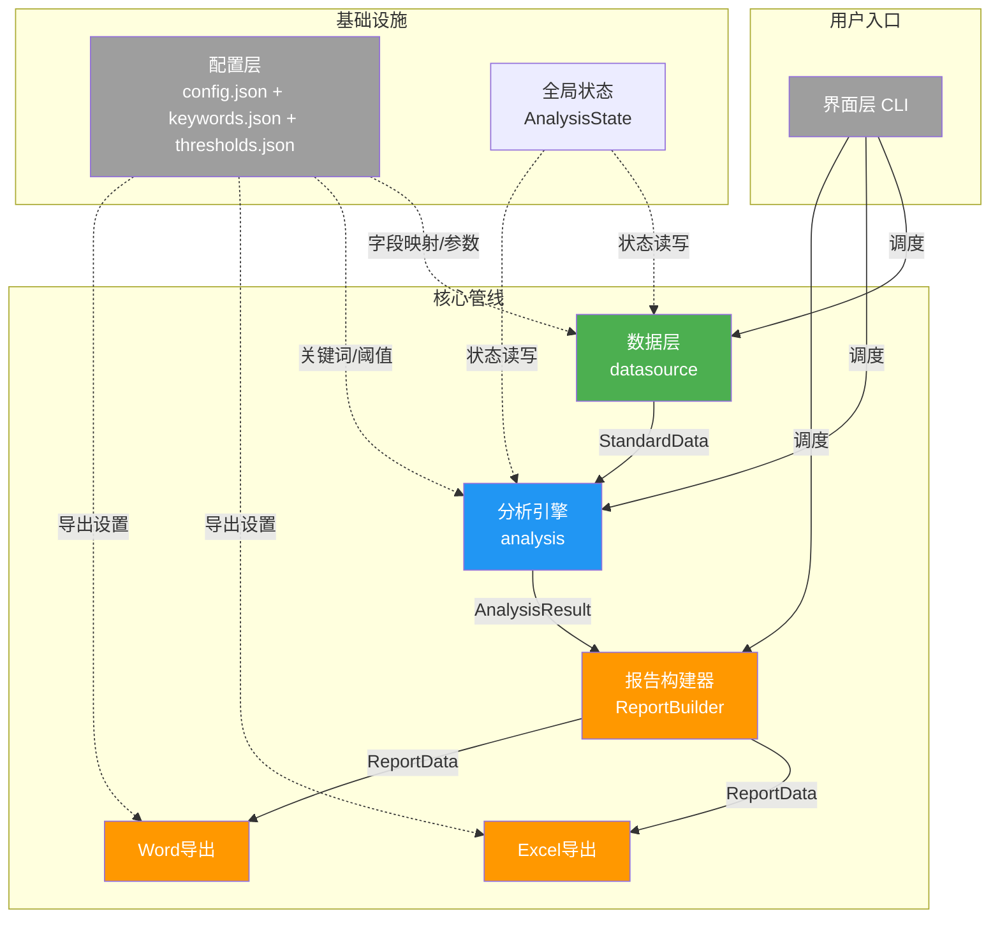
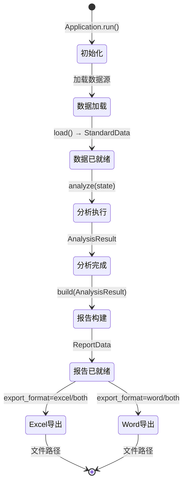

# 多源数据分析系统 - 模块设计

> 分析日期：2026-05-03 | 场景：场景B（开发新项目 - 基于现有项目重构）

---

## 三、怎么做（坡度三阶段）

### 阶段1：点出概念

> **系统架构一句话概述**：基于层级化状态治理的多源数据分析系统，以分析引擎为核心，数据层提供标准化数据，导出引擎消费分析结果生成报告。

### 阶段2：建立联系

**模块划分与接口契约**：

```
项目（多源数据分析系统）
├── 数据层（datasource） ✅ 需深入
│   ├── 内部状态：标准化DataFrame、字段映射、数据来源标识
│   └── 对外接口：load() → StandardData、get_persons() → List[str]
│
├── 分析引擎（analysis） ✅ 需深入
│   ├── 内部状态：分析结果对象（AnalysisResult）
│   └── 对外接口：analyze(state) → AnalysisResult
│
├── 导出引擎（export） ✅ 需深入
│   ├── 内部状态：导出配置、模板
│   └── 对外接口：export(report_data, format) → FilePath
│
├── 配置层（config） ❌ 当前文档说明
│   ├── 内部状态：配置字典
│   └── 对外接口：get(key) → Any
│
└── 界面层（interface） ❌ 当前文档说明
    ├── 内部状态：用户操作状态
    └── 对外接口：start() → None
```

**模块依赖关系图**：



**配置层说明**：
- **定义**：管理所有业务配置，包括字段映射、关键词库、阈值参数
- **关键点**：分层配置文件（config.json / keywords.json / thresholds.json），配置外置便于业务调整

**界面层说明**：
- **定义**：CLI交互界面，纯调度层
- **关键点**：只负责用户交互和流程调度，不包含任何数据处理逻辑

### 阶段3：详细讲解

---

### 3.1 全局状态设计（项目级单一状态源）

```python
from typing import TypedDict, Optional, List, Dict
from datetime import datetime
from enum import Enum

class DataSourceType(str, Enum):
    """数据源类型枚举"""
    BANK = "bank"
    WECHAT = "wechat"
    ALIPAY = "alipay"
    CALL = "call"

class AnalysisState(TypedDict):
    """项目级全局状态 - 所有模块共享"""
    # 已加载的数据源
    loaded_sources: Dict[DataSourceType, str]  # 类型 → 文件路径
    
    # 分析结果引用
    analysis_results: Dict[str, "AnalysisResult"]
    
    # 导出状态
    last_export_path: Optional[str]
    last_export_time: Optional[datetime]
    
    # 错误记录
    errors: List[dict]
```

**规则**：所有模块通过接口契约读写全局状态，禁止直接操作其他模块内部数据。

---

### 3.2 重构后的项目结构

```
datadone-re/
├── src/
│   ├── models/                        # 数据规矩层（Pydantic模型）
│   │   ├── __init__.py
│   │   ├── base.py                    # 基础模型定义
│   │   ├── transaction.py             # 交易数据模型
│   │   ├── call_record.py             # 话单数据模型
│   │   ├── analysis_result.py         # 分析结果模型
│   │   └── report.py                  # 报告数据模型
│   │
│   ├── datasource/                    # 数据层（数据加载+标准化）
│   │   ├── __init__.py
│   │   ├── base_loader.py             # 加载器基类
│   │   ├── bank_loader.py             # 银行数据加载器
│   │   ├── wechat_loader.py           # 微信数据加载器
│   │   ├── alipay_loader.py           # 支付宝数据加载器
│   │   ├── call_loader.py             # 话单数据加载器
│   │   └── field_mapper.py            # 字段映射器
│   │
│   ├── analysis/                      # 分析层（纯分析逻辑）
│   │   ├── __init__.py
│   │   ├── engine.py                  # 分析引擎（编排所有分析）
│   │   ├── frequency.py               # 频率分析
│   │   ├── cash_recognition.py        # 存取现识别
│   │   ├── special_analysis.py        # 特殊日期/金额分析
│   │   ├── cross_analysis.py          # 综合交叉分析
│   │   ├── key_transaction.py         # 关键交易识别
│   │   ├── fund_tracking.py           # 大额资金追踪
│   │   └── advanced.py                # 高级分析（时间模式/金额模式/异常检测）
│   │
│   ├── export/                        # 导出层（纯格式化输出）
│   │   ├── __init__.py
│   │   ├── base_exporter.py           # 导出器基类
│   │   ├── excel_exporter.py          # Excel报告导出
│   │   ├── word_exporter.py           # Word报告导出（合并新旧版）
│   │   └── formatters/                # 格式化工具
│   │       ├── __init__.py
│   │       ├── table_formatter.py     # 表格格式化
│   │       ├── chart_formatter.py     # 图表格式化
│   │       └── text_formatter.py      # 文本格式化
│   │
│   ├── config/                        # 配置层
│   │   ├── __init__.py
│   │   ├── settings.py                # 配置管理
│   │   ├── keywords.py                # 关键词库管理
│   │   └── thresholds.py              # 阈值管理
│   │
│   ├── interface/                     # 界面层
│   │   ├── __init__.py
│   │   └── cli.py                     # CLI界面
│   │
│   └── utils/                         # 工具层
│       ├── __init__.py
│       ├── logger.py                  # 日志工具
│       ├── cache.py                   # 缓存工具
│       ├── date_utils.py              # 日期工具（农历转换等）
│       └── validators.py             # 数据验证工具
│
├── config/                            # 配置文件目录
│   ├── config.json                    # 主配置
│   ├── keywords.json                  # 关键词库（从config.json抽取）
│   └── thresholds.json                # 阈值配置（从config.json抽取）
│
├── tests/                             # 测试目录
│   ├── test_models/
│   ├── test_datasource/
│   ├── test_analysis/
│   └── test_export/
│
├── docs/                              # 文档目录
├── data/                              # 输入数据目录
├── output/                            # 输出目录
├── pyproject.toml                     # 项目配置
└── main.py                            # 入口
```

---

### 3.3 数据层四层设计概要

> 详细设计见 [[04-数据层-四层设计]]

| 层面 | 设计内容 |
|-----|---------|
| **数据规矩** | `StandardTransaction`(Pydantic)：统一交易数据结构；`StandardCallRecord`(Pydantic)：统一话单数据结构 |
| **数据存储** | pandas DataFrame 内存存储；文件级缓存（pickle）；数据来源标识列 |
| **数据流转** | `load(path)` → 原始DataFrame → `validate()` → `map_fields()` → `standardize()` → StandardDataFrame |
| **接口层** | `BaseLoader.load(path) → StandardData`；`BaseLoader.get_persons() → List[str]`；`BaseLoader.get_data(person) → DataFrame` |

**关键改动**：
- 原BankDataModel中30+字段的config读取，改为 `field_mapper.py` 统一映射
- 存取现识别从数据模型中拆分到分析层
- 收入/支出列的计算从数据预处理移到分析层

---

### 3.4 分析引擎四层设计概要

> 详细设计见 [[05-分析引擎-四层设计]]

| 层面 | 设计内容 |
|-----|---------|
| **数据规矩** | `AnalysisResult`(Pydantic)：结构化分析结果，含7个子结果模块 |
| **数据存储** | AnalysisResult对象内存存储；可选pickle缓存 |
| **数据流转** | `engine.analyze(state) → AnalysisResult`；各子分析器接收StandardData，返回子结果 |
| **接口层** | `AnalysisEngine.analyze(state) → AnalysisResult`；各子分析器标准接口 |

**关键改动**：
- 新增 `AnalysisEngine` 作为统一入口，编排所有子分析器
- 分析结果统一为 Pydantic 模型，不再返回裸dict/DataFrame
- 导出器中散落的分析逻辑全部回收到分析层

---

### 3.5 导出引擎四层设计概要

> 详细设计见 [[06-导出引擎-四层设计]]

| 层面 | 设计内容 |
|-----|---------|
| **数据规矩** | `ReportData`(Pydantic)：报告所需的结构化数据；`ExportConfig`(Pydantic)：导出配置 |
| **数据存储** | 文件系统（.xlsx/.docx） |
| **数据流转** | `AnalysisResult → ReportBuilder.build() → ReportData → Exporter.export() → 文件` |
| **接口层** | `BaseExporter.export(report_data, config) → FilePath` |

**关键改动**：
- 导出器只接收 `ReportData`，不再执行任何分析计算
- 合并旧版/新版Word导出器为统一的 `WordExporter`，通过配置切换报告版本
- 格式化逻辑抽取到 `formatters/` 子模块

---

### 3.6 方法设计（状态流转）

**系统级状态流转图**：



**分析引擎路由表**：

```python
# 分析引擎路由表：分析类型 → 处理方法
class AnalysisEngine:
    def analyze(self, state: AnalysisState, analysis_type: str = 'all') -> AnalysisResult:
        """状态流转入口"""
        handlers = {
            'frequency': self._analyze_frequency,
            'cash': self._analyze_cash,
            'special': self._analyze_special,
            'cross': self._analyze_cross,
            'key_transaction': self._analyze_key_transactions,
            'fund_tracking': self._analyze_fund_tracking,
            'advanced': self._analyze_advanced,
            'all': self._analyze_all,
        }
        handler = handlers.get(analysis_type)
        if handler is None:
            raise ValueError(f"Unknown analysis type: {analysis_type}")
        return handler(state)
```

---

### 3.7 统一接口层

```python
# 应用入口：参数收敛 → 流程编排 → 结果输出
class Application:
    def run(self, data_paths: Dict[DataSourceType, str], 
            analysis_type: str = 'all',
            export_format: str = 'both') -> Dict[str, str]:
        """
        统一入口：加载 → 分析 → 导出
        Returns: {格式: 文件路径}
        """
        # 1. 加载数据
        state = self._load_data(data_paths)
        
        # 2. 执行分析
        analysis_result = self.analysis_engine.analyze(state, analysis_type)
        
        # 3. 构建报告数据
        report_data = self.report_builder.build(analysis_result)
        
        # 4. 导出报告
        output_paths = {}
        if export_format in ('excel', 'both'):
            output_paths['excel'] = self.excel_exporter.export(report_data)
        if export_format in ('word', 'both'):
            output_paths['word'] = self.word_exporter.export(report_data)
        
        return output_paths
```

---

### 3.8 重构迁移策略

**阶段1：建立骨架（先跑通流程）**
1. 创建 Pydantic 数据规矩模型
2. 实现 `BaseLoader` 和字段映射
3. 实现 `AnalysisEngine` 骨架（调用现有分析逻辑）
4. 实现 `ReportBuilder` 和 `BaseExporter` 骨架
5. 验证：用现有数据跑通完整流程，输出对比

**阶段2：迁移分析逻辑**
1. 将存取现识别从 BankDataModel 移到 `analysis/cash_recognition.py`
2. 将导出器中的分析逻辑回收到对应分析器
3. 实现各子分析器的独立返回结构
4. 验证：分析结果与现有输出对比

**阶段3：重构导出层**
1. 合并新旧Word导出器
2. 抽取格式化逻辑到formatters
3. 导出器只接收ReportData
4. 验证：导出报告与现有output完全一致

**阶段4：优化和增强**
1. 添加类型注解和文档
2. 添加单元测试
3. 性能优化（缓存、批量处理）
4. 可选：Web界面
