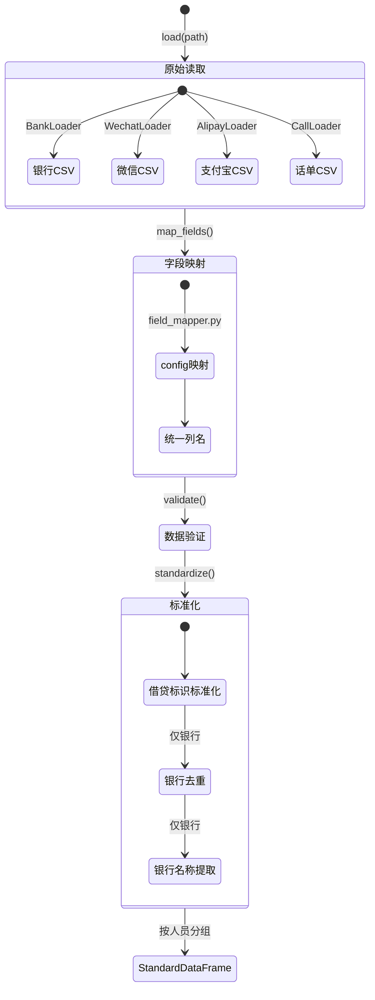

# 数据层 - 四层设计

> 所属项目：多源数据分析系统 | 源码参考：`original_ref/src/datasource/`

---

## 模块内部状态

```python
from typing import TypedDict, Optional, List, Dict
from datetime import datetime, date
from enum import Enum

class DataSourceType(str, Enum):
    """数据源类型"""
    BANK = "bank"
    WECHAT = "wechat"
    ALIPAY = "alipay"
    CALL = "call"

class StandardTransaction(TypedDict):
    """统一交易数据结构 - 所有平台标准化后的交易记录"""
    # 基础信息
    交易日期: date
    交易时间: Optional[str]        # 银行有，微信/支付宝可能无
    本方姓名: str
    本方账号: Optional[str]
    对方姓名: Optional[str]
    对方账号: Optional[str]
    
    # 金额信息
    交易金额: float                # 始终为正数
    借贷标识: str                  # 银行:借/贷, 微信:入/出, 支付宝:收入/支出
    收入金额: float                # 默认0，分析层填充
    支出金额: float                # 默认0，分析层填充
    账户余额: Optional[float]      # 仅银行有
    
    # 交易描述
    交易类型: Optional[str]
    交易摘要: Optional[str]
    交易备注: Optional[str]
    
    # 分析标记（分析层填充）
    存取现标识: str                # 默认'转账'，分析层识别后改为'存现'/'取现'
    特殊日期名称: Optional[str]    # 分析层填充
    
    # 元数据
    银行类型: Optional[str]        # 仅银行有
    数据来源: str                  # 文件名
    平台: DataSourceType           # 数据源类型

class StandardCallRecord(TypedDict):
    """统一话单数据结构"""
    通话开始时间: datetime
    本方姓名: str
    本方号码: str
    对方姓名: str
    对方号码: str
    对方单位名称: Optional[str]
    对方职务: Optional[str]
    呼叫类型: str                  # 主叫/被叫
    通话时长: int                  # 秒
    数据来源: str                  # 文件名
```

---

## 四层设计

| 层面 | 设计内容 |
|-----|---------|
| **数据规矩** | `StandardTransaction`(Pydantic)：统一交易数据结构，含姓名/日期/金额/方向/对方/来源等字段；`StandardCallRecord`(Pydantic)：统一话单数据结构。所有字段类型、约束、默认值已定义。`DataSourceType` 枚举限制数据源类型值 |
| **数据存储** | pandas DataFrame 内存存储；文件级缓存（pickle）；数据来源标识列标记每条记录的文件来源 |
| **数据流转** | `load(path)` → 原始DataFrame → `validate()` → `map_fields()` → `standardize()` → StandardDataFrame。流转中不执行分析计算（存取现识别、收入/支出计算移到分析层） |

**数据流转图**：


| **接口层** | `BaseLoader.load(path) → StandardData`；`BaseLoader.get_persons() → List[str]`；`BaseLoader.get_data(person) → DataFrame` |

---

## 对外接口契约

```python
from typing import Protocol, List, Optional, Dict
from pathlib import Path

class BaseLoader(Protocol):
    """数据加载器基类接口 - 所有平台加载器必须实现"""
    
    def load(self, path: str) -> Dict[str, "StandardDataFrame"]:
        """
        加载并标准化数据
        Args:
            path: 数据文件路径
        Returns:
            {本方姓名: 标准化DataFrame} 的字典
        """
        ...
    
    def get_persons(self) -> List[str]:
        """获取所有本方姓名列表"""
        ...
    
    def get_data(self, person: str) -> "DataFrame":
        """获取指定人员的标准化数据"""
        ...
    
    def validate(self, df: "DataFrame") -> bool:
        """验证数据完整性"""
        ...
```

---

## 平台差异详解

### 4.1 银行数据加载器（BankLoader）

**字段映射**（从config.json读取，`field_mapper.py`统一处理）：

| 标准字段 | 典型原始列名 | 说明 |
|---------|-------------|------|
| 交易日期 | 交易日期/交易时间 | 日期解析，支持多种格式 |
| 交易时间 | 交易时间 | 时分秒 |
| 本方姓名 | 持卡人姓名/客户名称 | 被分析人 |
| 本方账号 | 本方账号/卡号 | 银行账号 |
| 对方姓名 | 对方姓名/收款人 | 交易对手 |
| 对方账号 | 对方账号/收款账号 | 对手账号 |
| 交易金额 | 交易金额/发生额 | 始终取绝对值 |
| 借贷标识 | 借贷标志/交易方向 | 标准化为'借'/'贷' |
| 账户余额 | 账户余额/当前余额 | 交易后余额 |
| 交易类型 | 交易渠道/交易方式 | |
| 交易摘要 | 摘要/交易摘要 | |
| 交易备注 | 备注/交易备注 | |

**银行名称提取逻辑**（优先级递减）：
1. 已有 `银行类型` 列 → 直接使用
2. 从 `交易机构名称` 列提取（关键词匹配：建行→建设银行、工行→工商银行等）
3. 从 `对方银行名称` 列提取
4. 从 `本方账号` 列提取（卡号前缀映射）：
   ```
   622848→农业银行, 622700→建设银行, 621700→建设银行,
   621226→工商银行, 622202→工商银行, 622262→交通银行,
   622666→中国银行, 622588→招商银行, 622155→浦发银行,
   622916→民生银行, 622909→兴业银行, 621095→邮政储蓄银行
   ```

**银行数据智能去重** `remove_bank_duplicates()`：
- 银行数据执行智能去重
- 微信/支付宝**不执行**去重

**银行数据的借贷标识处理**：
- `'贷'` = 收入方向
- `'借'` = 支出方向

### 4.2 微信数据加载器（WechatLoader）

**借贷标识标准化**：
- `'入'` → 收入
- `'出'` → 支出

**收入/支出计算**（分析层处理）：
- `借贷标识=='入'` → `收入金额 = |交易金额|`
- `借贷标识=='出'` → `支出金额 = |交易金额|`

**微信特有字段**：商品说明、支付状态等

**无存取现识别**：微信数据不执行存取现识别

### 4.3 支付宝数据加载器（AlipayLoader）

**借贷标识标准化**：
- `'收入'` → 收入
- `'支出'` → 支出

**收入/支出计算**（分析层处理）：
- `借贷标识=='收入'` → `收入金额 = |交易金额|`
- `借贷标识=='支出'` → `支出金额 = |交易金额|`

**无存取现识别**：支付宝数据不执行存取现识别

### 4.4 话单数据加载器（CallLoader）

**字段映射**：

| 标准字段 | 典型原始列名 |
|---------|-------------|
| 通话开始时间 | 通话开始时间 |
| 本方姓名 | 持有人姓名/机主姓名 |
| 本方号码 | 本方号码/手机号码 |
| 对方姓名 | 对方姓名/通话对方 |
| 对方号码 | 对方号码 |
| 对方单位名称 | 对方单位名称/单位 |
| 对方职务 | 对方职务 |
| 呼叫类型 | 呼叫类型/通话类型 | 主叫/被叫 |
| 通话时长 | 通话时长 | 秒 |

**对方信息补充**：话单数据中的对方单位名称和职务信息是综合交叉分析中补充对方信息的关键来源。
