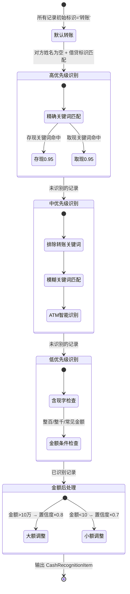

# 存取现识别 - 四层设计

> 所属模块：分析引擎 | 实现位置：`src/analysis/cash_recognition.py`
> 原参考：`original_ref/src/utils/cash_recognition.py` → `CashRecognitionEngine`

---

## 模块内部状态

```python
from pydantic import BaseModel

class CashRecognitionItem(BaseModel):
    """存取现识别结果"""
    index: int                      # 原始数据行索引
    cash_type: str                  # '存现' | '取现' | '转账'
    confidence: float               # 置信度 0-1
    reason: str                     # 识别原因
```

---

## 四层设计

| 层面 | 设计内容 |
|-----|---------|
| **数据规矩** | `CashRecognitionItem`(Pydantic)：index(int)、cash_type(枚举:存现/取现/转账)、confidence(float 0-1)、reason(str)。默认标识为'转账'，识别后改为'存现'/'取现' |
| **数据存储** | 结果存入 `AnalysisResult.cash_recognition`，键为 `{本方姓名: [识别结果]}`。仅适用于银行数据，微信/支付宝不执行 |
| **数据流转** | 高优先级识别(0.95) → 中优先级识别(0.8) → 低优先级识别(0.6) → 金额后处理。每级在前一级未识别的记录上继续 |

**识别流转图**：


| **接口层** | `CashRecognizer.analyze(bank_data, config) → Dict[str, List[CashRecognitionItem]]` |

---

## 对外接口契约

```python
from typing import Protocol, Dict, List

class CashRecognizer(Protocol):
    """存取现识别器接口"""
    
    def analyze(self, bank_data: Dict[str, "DataFrame"], config: dict) -> Dict[str, List[CashRecognitionItem]]:
        """
        对银行数据执行存取现识别
        Args:
            bank_data: {本方姓名: 标准化银行DataFrame}
            config: 含关键词库和排除词库
        Returns:
            {本方姓名: [CashRecognitionItem]}
        """
        ...
```

---

## 精确算法规则

### 算法概述

采用**三级优先级递进识别**：
1. **高优先级**（置信度0.95）：精确关键词匹配
2. **中优先级**（置信度0.8）：模糊关键词匹配 + 转账排除
3. **低优先级**（置信度0.6）：上下文分析（"现"字 + 金额特征）
4. **金额后处理**：大额/小额置信度调整

**默认标识**：所有记录初始标识为 `'转账'`，识别后才改为 `'存现'` 或 `'取现'`。

**仅适用于银行数据**：微信/支付宝不执行存取现识别。

---

### 前置条件

所有识别必须满足的公共条件：
- **对方姓名为空**：`对方姓名 IS NULL OR 对方姓名 == '' OR 对方姓名 == '\N'`
- **当前标识为转账**：`存取现标识 == '转账'`（避免重复识别）

存现额外条件：`借贷标识 == '贷'`（收入标志）
取现额外条件：`借贷标识 == '借'`（支出标志）

---

### 高优先级识别（置信度0.95）

**高优先级存现关键词**（精确匹配）：
```
ATM存现, ATM存款, ATM存, CRS无卡存现, 柜台存现, 现金存款, 现金缴存, 
无卡存现, 无折存现, 自助存现, 自助存款
```

**高优先级取现关键词**（精确匹配）：
```
ATM取现, ATM取款, ATM取, CRS无卡取现, 柜台取现, 现金取款, 现金支取, 
无卡取现, 无折取现, 自助取现, 自助取款
```

**匹配范围**：`交易摘要 OR 交易备注 OR 交易类型` 包含关键词（大小写不敏感）

**排除规则**：同时包含存取现排除关键词（见下方排除词库）的记录不识别

---

### 中优先级识别（置信度0.8）

**存现关键词**（模糊匹配，50+个，存入 `config/keywords.json`）：
```
存, 现金存, 柜台存, 存款, 现金存入, 存现, ATM存, ATM存款, ATM存现, ATM, 
自助存款, 自助存现, CRS存现, CRS无卡存现, 无卡存现, 无折存现, 现金缴存,
现金存缴, 柜面存现, 柜面存款, 网点存现, 银行存现, 存入现金, 现金投入, 
投入现金, 存钱, 存入, 缴存, 存储, 储蓄存款, 活期存款, 定期存款, 整存整取,
零存整取, 存单, 存折存款, 卡存, 折存, 现存, 钞存, 币存, 人民币存款,
外币存款, 美元存款, 港币存款, 欧元存款, 日元存款, 英镑存款, 存入资金,
资金存入, 款项存入, 存入款项, 现金入账, 入账现金, 现金充值, 充值现金,
现金补充, 补充现金
```

**取现关键词**（模糊匹配，50+个，存入 `config/keywords.json`）：
```
取, 现金取, 柜台取, ATM取, 取款, 现金支取, 取现, ATM取现, ATM取款, ATM,
自助取款, 自助取现, CRS取现, CRS无卡取现, 无卡取现, 无折取现, 现金支付,
现金提取, 柜面取现, 柜面取款, 网点取现, 银行取现, 提取现金, 现金提现,
提现, 取钱, 取出, 支取, 提取, 储蓄取款, 活期取款, 定期取款, 整存整取支取,
零存整取支取, 存单支取, 存折取款, 卡取, 折取, 现取, 钞取, 币取,
人民币取款, 外币取款, 美元取款, 港币取款, 欧元取款, 日元取款, 英镑取款,
取出资金, 资金取出, 款项取出, 取出款项, 现金出账, 出账现金, 现金消费,
消费现金, 现金支出, 支出现金, 现金减少, 减少现金
```

**识别流程**：
1. 基础条件筛选（对方姓名为空 + 借贷标识正确 + 当前为转账）
2. **先排除转账**：排除包含排除关键词的记录
3. 再匹配存取现关键词

**ATM智能识别**（中优先级子步骤）：
- 在排除转账后，搜索 `摘要/备注/类型` 包含 `'ATM'` 的记录
- 存现方向：标记为存现，置信度0.8
- 取现方向：标记为取现，置信度0.8

---

### 低优先级识别（置信度0.6）

**条件**：对方姓名为空 + 包含"现"字 + 当前为转账 + 排除转账关键词

**额外金额条件**（必须满足之一）：
- 整百/整千金额：`金额 % 50 == 0 OR 金额 % 100 == 0`
- 常见存取现金额：`金额 IN [100, 200, 300, 500, 1000, 2000, 3000, 5000, 10000, 20000, 50000]`

---

### 排除关键词库（存入 `config/keywords.json`）

**存现排除关键词**（50+个）：
```
转账, 转存, 存息, 利息存入, 息存, 续存, 转账存入, 代发存入, 工资存入,
奖金存入, 补贴存入, 退款存入, 返还存入, 理财存入, 基金存入, 股票存入,
债券存入, 保险存入, 贷款存入, 放款存入, 借款存入, 还款存入, 代收存入,
代付存入, 第三方存入, 网银存入, 手机银行存入, 微信存入, 支付宝存入,
POS存入, 刷卡存入, 扫码存入, 二维码存入, 电子存入, 在线存入, 网上存入,
移动存入, 快捷存入, 即时存入, 实时存入, 批量存入, 集中存入, 统一存入,
自动存入, 定时存入, 预约存入, 委托存入, 代理存入, 中介存入, 经纪存入,
托管存入, 监管存入, 保证金存入, 押金存入, 定金存入, 预付款存入, 订金存入
```

**取现排除关键词**（50+个）：
```
转账, 转取, 利息取出, 息取, 转账取出, 代发取出, 工资取出, 奖金取出,
补贴取出, 退款取出, 返还取出, 理财取出, 基金取出, 股票取出, 债券取出,
保险取出, 贷款取出, 放款取出, 借款取出, 还款取出, 代收取出, 代付取出,
第三方取出, 网银取出, 手机银行取出, 微信取出, 支付宝取出, POS取出,
刷卡取出, 扫码取出, 二维码取出, 电子取出, 在线取出, 网上取出, 移动取出,
快捷取出, 即时取出, 实时取出, 批量取出, 集中取出, 统一取出, 自动取出,
定时取出, 预约取出, 委托取出, 代理取出, 中介取出, 经纪取出, 托管取出,
监管取出, 保证金取出, 押金取出, 定金取出, 预付款取出, 订金取出
```

---

### 金额后处理

- **大额调整**：金额 > 100000 时，置信度 × 0.8，识别原因追加 `(大额交易置信度调整)`
- **小额调整**：金额 < 10 时，置信度 × 0.7，识别原因追加 `(小额交易置信度调整)`

---

### 存取现后的收入/支出计算

**存现**：`收入金额 = 交易金额.abs()`
**取现**：`支出金额 = 交易金额.abs()`
**转账**：
- `借贷标识 == '贷'` → `收入金额 = 交易金额.abs()`
- `借贷标识 == '借'` → `支出金额 = 交易金额.abs()`
