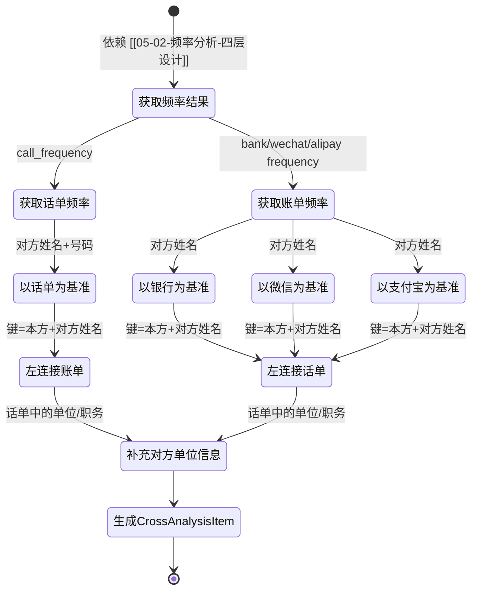

# 综合交叉分析 - 四层设计

> 所属模块：分析引擎 | 实现位置：`src/analysis/cross_analysis.py`
> 原参考：`original_ref/src/analysis/comprehensive_analyzer.py`

---

## 模块内部状态

```python
from pydantic import BaseModel
from typing import Optional

class CrossAnalysisItem(BaseModel):
    """综合交叉分析结果"""
    分析基准: str
    本方姓名: str
    对方姓名: str
    对方号码: Optional[str]
    对方单位名称: Optional[str]
    对方职务: Optional[str]
    通话次数: Optional[int]
    通话总时长: Optional[float]
    收入总额: Optional[float]
    支出总额: Optional[float]
    交易次数: Optional[int]
    平台: Optional[str]
    平台金额分布: Optional[str]
    银行_收入总额: Optional[float]
    银行_支出总额: Optional[float]
    银行_交易次数: Optional[int]
    微信_收入总额: Optional[float]
    微信_支出总额: Optional[float]
    微信_交易次数: Optional[int]
    支付宝_收入总额: Optional[float]
    支付宝_支出总额: Optional[float]
    支付宝_交易次数: Optional[int]
```

---

## 四层设计

| 层面 | 设计内容 |
|-----|---------|
| **数据规矩** | `CrossAnalysisItem`(Pydantic)：含基准/姓名/对方信息/通话/交易/平台明细等22个字段，所有字段类型和约束已定义 |
| **数据存储** | 结果存入 `AnalysisResult.cross_analysis`，键为 `{基准名: [交叉结果]}` |
| **数据流转** | 以某数据源频率为主表 → 与其他数据源频率表左连接(键:本方姓名+对方姓名) → 补充对方单位信息 → 生成各基准表 |

**交叉分析流转图**：


| **接口层** | `CrossAnalyzer.analyze(freq_result, call_freq_result, config) → Dict[str, List[CrossAnalysisItem]]` |

---

## 对外接口契约

```python
from typing import Protocol, Dict, List

class CrossAnalyzer(Protocol):
    """综合交叉分析器接口"""
    
    def analyze(self, 
                freq_result: Dict[str, List["FrequencyItem"]], 
                call_freq_result: List["CallFrequencyItem"],
                config: dict) -> Dict[str, List[CrossAnalysisItem]]:
        """
        综合交叉分析
        Args:
            freq_result: 频率分析结果（来自 [[05-02-频率分析-四层设计]]）
            call_freq_result: 话单频率结果
            config: 分析配置
        Returns:
            {基准名: [CrossAnalysisItem]}
        """
        ...
```

---

## 精确算法规则

### 核心原则

**严格匹配**：仅按 `(本方姓名, 对方姓名)` 完全匹配，**禁止跨人员关联**。

---

### 话单为基准的交叉分析

1. 以话单频率为主表，键为 `(本方姓名, 对方姓名)`
2. 与银行/微信/支付宝频率表分别左连接，键为 `(本方姓名, 对方姓名)`
3. 合并后列结构：
   - 基础列：`分析基准='以话单为基准' | 本方姓名 | 对方姓名 | 对方号码 | 对方单位名称 | 对方职务`
   - 话单列：`通话次数 | 通话总时长(分钟)`
   - 账单列：`收入总额 | 支出总额 | 交易次数`
   - 平台列：`平台 | 平台金额分布`
   - 银行明细：`银行_收入总额 | 银行_支出总额 | 银行_交易次数`
   - 微信明细：`微信_收入总额 | 微信_支出总额 | 微信_交易次数`
   - 支付宝明细：`支付宝_收入总额 | 支付宝_支出总额 | 支付宝_交易次数`

**平台金额分布格式**：`"银行(收入X元,支出Y元); 微信(收入X元,支出Y元); 支付宝(收入X元,支出Y元)"`

**单位补充逻辑**：
- 从话单数据创建全局联系人映射：`对方姓名 → 对方单位名称`
- 对综合分析结果中缺失的对方单位，使用该映射填充

---

### 账单为基准的交叉分析

1. 以指定平台（银行/微信/支付宝）频率为主表
2. 与其他平台和话单频率表左连接
3. 分析基准 = `'以银行为基准'` / `'以微信为基准'` / `'以支付宝为基准'`

---

### 各平台生成规则

对每个可用的数据源，都生成一份以该数据源为基准的综合分析表。
