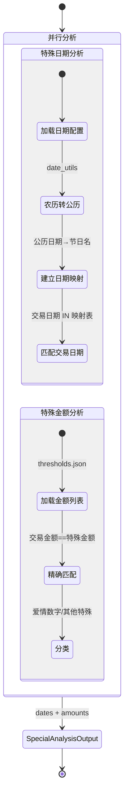

# 特殊分析 - 四层设计

> 所属模块：分析引擎 | 实现位置：`src/analysis/special_analysis.py`
> 原参考：`original_ref/src/utils/advanced_analysis.py`

---

## 模块内部状态

```python
from pydantic import BaseModel
from datetime import date
from typing import Optional

class SpecialDateItem(BaseModel):
    """特殊日期分析结果"""
    index: int
    交易日期: date
    特殊日期名称: str               # '春节'|'情人节'等

class SpecialAmountItem(BaseModel):
    """特殊金额分析结果"""
    index: int
    交易金额: float
    特殊类型: str                   # '爱情数字'|'其他特殊金额'
    特殊金额名: str                 # '520'|'1314'等

class SpecialAnalysisOutput(BaseModel):
    """特殊分析总输出"""
    dates: dict                     # {本方姓名: [SpecialDateItem]}
    amounts: dict                   # {本方姓名: [SpecialAmountItem]}
```

---

## 四层设计

| 层面 | 设计内容 |
|-----|---------|
| **数据规矩** | `SpecialDateItem`(Pydantic)：index/交易日期/特殊日期名称；`SpecialAmountItem`(Pydantic)：index/交易金额/特殊类型/特殊金额名。日期支持农历/公历，金额精确匹配 |
| **数据存储** | 日期结果存入 `AnalysisResult.special_dates`；金额结果存入 `AnalysisResult.special_amounts` |
| **数据流转** | 加载特殊日期配置 → 农历转公历 → 建立日期映射 → 匹配交易日期；加载特殊金额列表 → 精确匹配交易金额 |

**特殊分析流转图**：


| **接口层** | `SpecialAnalyzer.analyze(all_data, config) → SpecialAnalysisOutput` |

---

## 对外接口契约

```python
from typing import Protocol

class SpecialAnalyzer(Protocol):
    """特殊分析器接口"""
    
    def analyze(self, all_data: dict, config: dict) -> SpecialAnalysisOutput:
        """
        执行特殊日期和特殊金额分析
        Args:
            all_data: 标准化数据（按平台分组）
            config: 含特殊日期配置和特殊金额列表
        Returns:
            SpecialAnalysisOutput
        """
        ...
```

---

## 精确算法规则

### 特殊日期分析

#### 特殊日期配置（存入 `config/thresholds.json`）

| 日期名 | 类型 | 月 | 日 |
|-------|------|---|---|
| 元旦 | solar | 1 | 1 |
| 春节 | lunar | 1 | 1 |
| 元宵节 | lunar | 1 | 15 |
| 情人节 | solar | 2 | 14 |
| 妇女节 | solar | 3 | 8 |
| 清明节 | solar | 4 | 5 |
| 劳动节 | solar | 5 | 1 |
| 端午节 | lunar | 5 | 5 |
| 儿童节 | solar | 6 | 1 |
| 七夕 | lunar | 7 | 7 |
| 建军节 | solar | 8 | 1 |
| 中秋节 | lunar | 8 | 15 |
| 教师节 | solar | 9 | 10 |
| 国庆节 | solar | 10 | 1 |
| 重阳节 | lunar | 9 | 9 |
| 冬至 | solar | 12 | 22 |
| 平安夜 | solar | 12 | 24 |
| 圣诞节 | solar | 12 | 25 |

#### 农历转换

- 使用 `zhdate.ZhDate` 库将农历日期转换为公历日期
- 对数据中出现的每个年份，预计算所有特殊日期的公历日期
- 建立 `日期 → 节日名称` 的映射

#### 匹配规则

- 将交易日期标准化为 `date` 对象
- 在映射表中查找，匹配到的记录添加 `特殊日期名称` 列

---

### 特殊金额分析

#### 特殊金额列表（存入 `config/thresholds.json`）

**爱情数字**（Word报告分类用）：
```
520, 521, 1314, 13140, 131400, 5200, 52000, 520000
52.0, 13.14
```

**其他特殊金额**：
```
6.66, 8.88, 66, 88, 99, 166, 188, 200, 288, 366, 388, 588, 666, 688, 777,
888, 999, 1688, 1888, 2888, 3888, 5888, 6666, 8888, 9999, 16888, 18888,
28888, 38888, 58888, 66666, 88888, 99999, 168888, 188888, 288888, 388888,
588888, 666666, 888888, 999999
```

#### 匹配规则

- `|交易金额| IN 特殊金额列表`（精确匹配）
- 匹配到的记录作为特殊金额交易

---

### 整数金额分析

**阈值**（存入 `config/thresholds.json`）：
- 银行：`交易金额 >= 1000 AND 交易金额 % 100 == 0`
- 微信：`交易金额 >= 200 AND 交易金额 % 100 == 0`
- 支付宝：`交易金额 >= 200 AND 交易金额 % 100 == 0`
