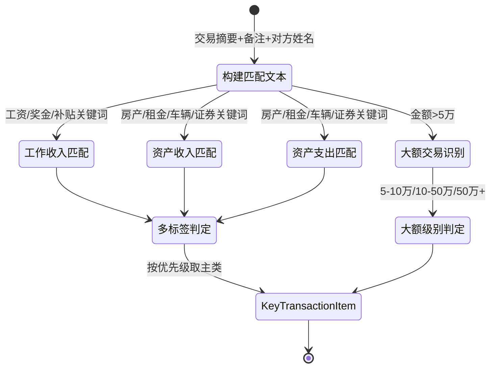

# 重点收支识别 - 四层设计

> 所属模块：分析引擎 | 实现位置：`src/analysis/key_transaction.py`
> 原参考：`original_ref/src/utils/key_transactions.py`

---

## 模块内部状态

```python
from pydantic import BaseModel
from datetime import date

class KeyTransactionItem(BaseModel):
    """重点收支识别结果"""
    index: int
    本方姓名: str
    交易日期: date
    交易金额: float
    交易方向: str                   # '收入' | '支出'
    重点类型: str                   # '工作收入'|'资产收入'|'资产支出'|'大额收入'|'大额支出'
    重点子类: str                   # '工资奖金'|'房产'|'租金'|'车辆收入'等
    匹配关键词: str
    置信度: float
```

---

## 四层设计

| 层面 | 设计内容 |
|-----|---------|
| **数据规矩** | `KeyTransactionItem`(Pydantic)：index/姓名/日期/金额/方向/类型/子类/关键词/置信度。类型枚举5种，子类根据关键词匹配确定，多标签时按优先级取主类 |
| **数据存储** | 结果存入 `AnalysisResult.key_transactions`，键为 `{本方姓名: [重点收支]}` |
| **数据流转** | 构建匹配文本 → 逐类别关键词匹配 → 多标签优先级判定 → 大额交易级别判定 |

**重点收支识别流转图**：


| **接口层** | `KeyTransactionAnalyzer.analyze(all_data, config) → Dict[str, List[KeyTransactionItem]]` |

---

## 对外接口契约

```python
from typing import Protocol, Dict, List

class KeyTransactionAnalyzer(Protocol):
    """重点收支识别器接口"""
    
    def analyze(self, all_data: Dict[str, "DataFrame"], config: dict) -> Dict[str, List[KeyTransactionItem]]:
        """
        识别重点收支交易
        Args:
            all_data: {平台: 标准化DataFrame}
            config: 含关键词库和大额阈值配置
        Returns:
            {本方姓名: [KeyTransactionItem]}
        """
        ...
```

---

## 精确算法规则

### 匹配文本构建

合并以下列（空值填充为空字符串，空格分隔）：
```
匹配文本 = 交易摘要 + ' ' + 交易备注 + ' ' + 交易类型 + ' ' + 对方姓名
```

---

### 工作收入识别

**条件**：`交易金额 > 0`（收入方向）

**关键词**（30+个，存入 `config/keywords.json`）：
```
工资, 薪资, 薪水, 月薪, 年薪, 奖金, 年终奖, 季度奖, 月度奖, 绩效奖,
津贴, 补贴, 提成, 佣金, 劳务费, 咨询费, 服务费, 代发工资, 代发薪资,
代发奖金, 代发津贴, 代发补贴, 代发劳务费, 工资发放, 薪资发放,
奖金发放, 津贴发放, 补贴发放, 劳务费发放, 年终奖发放, 绩效奖发放,
提成发放, 佣金发放
```

---

### 房产收入/支出识别

**关键词**（25+个，存入 `config/keywords.json`）：
```
房款, 售房, 卖房, 房屋出售, 房产出售, 房屋转让, 房产转让, 房屋买卖,
房产买卖, 房屋交易, 房产交易, 房屋过户, 房产过户, 售房款, 卖房款,
房屋出售款, 房产出售款, 房屋转让款, 房产转让款, 房屋交易款, 房产交易款,
售房收入, 卖房收入, 房屋出售收入, 房产出售收入, 房屋尾款, 房产尾款,
售房尾款, 卖房尾款
```

- 收入：`交易金额 > 0 AND 匹配文本包含房产关键词`
- 支出：`交易金额 < 0 AND 匹配文本包含房产关键词`

---

### 租金收入/支出识别

**关键词**（35+个，存入 `config/keywords.json`）：
```
租金, 房租, 出租, 租赁, 房租收入, 租房收入, 出租收入, 房屋租金,
房产租金, 房屋租金收入, 房产租金收入, 租赁收入, 租赁费, 租赁款,
商铺租金, 店铺租金, 写字楼租金, 办公室租金, 厂房租金, 仓库租金,
车位租金, 停车位租金, 场地租金, 商铺租金收入, 店铺租金收入,
写字楼租金收入, 办公室租金收入, 厂房租金收入, 仓库租金收入,
车位租金收入, 停车位租金收入, 场地租金收入, 租房, 承租, 租房费,
租房款, 房租支出, 租金支出, 租赁支出, 房屋租赁, 商铺租赁, 店铺租赁,
写字楼租赁, 办公室租赁, 厂房租赁, 仓库租赁, 车位租赁, 停车位租赁,
场地租赁
```

---

### 车辆收入/支出识别

**关键词**（50+个，存入 `config/keywords.json`）：
```
车款, 售车, 卖车, 买车, 购车, 车辆出售, 车辆转让, 车辆买卖, 车辆交易,
车辆过户, 车辆购买, 汽车出售, 汽车转让, 汽车买卖, 汽车交易, 汽车过户,
汽车购买, 汽车销售, 汽车贷款, 车贷, 二手车, 二手车出售, 二手车转让,
二手车购买, 新车, 新车购买, 售车款, 卖车款, 买车款, 购车款, 车辆出售款,
车辆转让款, 车辆交易款, 车辆购买款, 汽车出售款, 汽车转让款, 汽车交易款,
汽车购买款, 汽车销售款, 二手车出售款, 二手车转让款, 二手车购买款,
售车收入, 卖车收入, 车辆出售收入, 汽车出售收入, 车辆尾款, 汽车尾款,
售车尾款, 卖车尾款, 买车尾款, 购车尾款, 车辆首付, 汽车首付, 购车首付,
买车首付, 车辆定金, 汽车定金, 购车定金, 买车定金, 汽车置换, 车辆置换,
置换补贴, 汽车补贴, 购车补贴, 车辆补贴
```

---

### 证券收入/支出识别

**关键词**（40+个，存入 `config/keywords.json`）：
```
股票, 基金, 证券, 股权, 债券, 期货, 期权, 理财, 投资, 分红, 股息,
红利, 配股, 送股, 转股, 股票收益, 基金收益, 证券收益, 股权收益,
债券收益, 期货收益, 期权收益, 理财收益, 投资收益, 股票分红, 基金分红,
证券分红, 股息收入, 红利收入, 分红收入, 资本收益, 投资回报, 理财到期,
基金赎回, 理财到期收益, 基金赎回收益, 股票交易, 基金交易, 证券交易,
理财产品, 投资产品
```

---

### 大额交易识别

**阈值配置**（存入 `config/thresholds.json`）：

| 级别 | 最小金额 | 最大金额 | 名称 |
|------|---------|---------|------|
| level1 | 50,000 | 100,000 | 5万-10万 |
| level2 | 100,000 | 500,000 | 10万-50万 |
| level3 | 500,000 | 1,000,000 | 50万-100万 |
| level4 | 1,000,000 | 999,999,999 | 100万及以上 |

**条件**：`|交易金额| >= 级别最小金额 AND |交易金额| < 级别最大金额`

---

### 重点收支优先级（多标签时取主类）

按优先级确定主要的重点收支类型：
1. 工作收入（最高优先级）→ 类型=`工作收入`，子类=`工资奖金`
2. 房产收入 → 类型=`资产收入`，子类=`房产`
3. 租金收入 → 类型=`资产收入`，子类=`租金`
4. 车辆收入 → 类型=`资产收入`，子类=`车辆收入`
5. 车辆支出 → 类型=`资产支出`，子类=`车辆支出`
6. 房产支出 → 类型=`资产支出`，子类=`房产支出`
7. 证券收入 → 类型=`资产收入`，子类=`证券收入`
8. 证券支出 → 类型=`资产支出`，子类=`证券支出`
9. 租金支出 → 类型=`资产支出`，子类=`租金支出`
10. 大额收入 → 类型=`大额收入`，子类=`大额级别名称`
11. 大额支出 → 类型=`大额支出`，子类=`大额级别名称`

**注意**：一个交易可以同时有多个标签（如既是房产收入又是大额收入），但"重点收支类型"只取最高优先级的那个。
