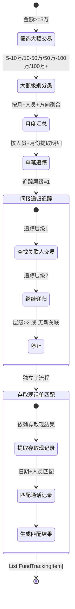

# 大额资金追踪 - 四层设计

> 所属模块：分析引擎 | 实现位置：`src/analysis/fund_tracking.py`
> 原参考：`original_ref/src/utils/fund_tracking.py`

---

## 模块内部状态

```python
from pydantic import BaseModel
from datetime import date
from typing import Optional

class FundTrackingItem(BaseModel):
    """大额资金追踪结果"""
    分析类型: str                   # '大额资金追踪'|'存取现话单匹配'
    追踪层级: int                   # 0=直接, 1=间接第一层, 2=间接第二层
    核心人员: str
    关联人员: str
    交易日期: Optional[date]
    交易金额: Optional[float]
    交易方向: str                   # '收入'|'支出'|'汇总'
    大额级别: Optional[str]         # '5万-10万'|'10万-50万'等
    数据来源: Optional[str]
    资金流向: str                   # '直接交易'|'间接追踪'|'月度汇总'
    追踪说明: str
    月份: Optional[str]             # YYYY-MM
    # 话单匹配字段（仅存取现话单匹配时有值）
    通话日期: Optional[date]
    通话对方: Optional[str]
    通话对方单位: Optional[str]
```

---

## 四层设计

| 层面 | 设计内容 |
|-----|---------|
| **数据规矩** | `FundTrackingItem`(Pydantic)：含分析类型/追踪层级/核心人员/关联人员/金额/方向/级别/来源/流向/说明/话单匹配等15个字段。追踪层级0-2，递归最大深度3 |
| **数据存储** | 追踪结果存入 `AnalysisResult.fund_tracking`（List）；存取现话单匹配存入 `AnalysisResult.cash_call_match`（List） |
| **数据流转** | 筛选大额交易 → 按月份/人员分组 → 月度汇总 → 单笔追踪 → 间接递归追踪 → 存取现话单匹配 |

**大额资金追踪流转图**：


| **接口层** | `FundTracker.analyze(all_data, cash_result, config) → FundTrackingOutput` |

---

## 对外接口契约

```python
from typing import Protocol, List

class FundTrackingOutput:
    """大额资金追踪总输出"""
    tracking: List[FundTrackingItem]
    cash_call_match: List[FundTrackingItem]

class FundTracker(Protocol):
    """大额资金追踪器接口"""
    
    def analyze(self, all_data: dict, cash_result: dict, config: dict) -> FundTrackingOutput:
        """
        执行大额资金追踪和存取现话单匹配
        Args:
            all_data: 标准化数据（按平台分组）
            cash_result: 存取现识别结果（来自 [[05-01-存取现识别-四层设计]]）
            config: 含大额阈值和追踪配置
        Returns:
            FundTrackingOutput
        """
        ...
```

---

## 精确算法规则

### 大额交易筛选

**最小阈值**：50,000元（取所有级别中的最小min值）

**级别判定**：
```python
for level in large_amount_thresholds:
    if level.min <= abs(amount) < level.max:
        return level.name
```

---

### 追踪流程

1. 从所有数据模型中提取大额交易（`|交易金额| >= 50000`）
2. 合并所有大额交易，按交易日期排序
3. 按月份和人员分组
4. 对每个人员-月份组合：
   - 生成月度汇总记录
   - 逐笔追踪单笔交易

---

### 月度汇总记录

```
追踪层级 = 当前深度
核心人员 = 人员姓名
关联人员 = '月度汇总'
交易日期 = 'YYYY年MM月'
交易金额 = 月收入 - 月支出（净流入）
交易方向 = '汇总'
大额级别 = max(|月收入|, |月支出|) 对应的级别
资金流向 = '月度汇总'
追踪说明 = 详细备注（含资金来源和去向明细）
```

**备注生成规则**：
- 收入部分：`资金来源：总收入X元；现金收入X元；银行转账收入X元(A银行转账X元、B银行转账X元)；微信收入X元(...)；支付宝收入X元(...)`
- 支出部分：`资金去向：总支出X元；...`
- 净流入/流出：`净流入X元` 或 `净流出X元`

---

### 单笔交易追踪

```
追踪层级 = 当前深度（0=直接交易）
核心人员 = 本方姓名
关联人员 = 对方姓名
交易日期 = 交易日期
交易金额 = 交易金额
交易方向 = 收入/支出
大额级别 = 金额级别
数据来源 = 银行名称（银行数据）/ 平台名
资金流向 = '直接交易'
追踪说明 = '{本方姓名} {方向} {金额}元给{对方姓名}'
```

---

### 间接追踪（递归）

**条件**：当交易方向为"支出"时，追踪对方人员的资金去向

**时间窗口**：交易日期 ± 30天（`tracking_window_days = 30`）

**最大深度**：3层（`max_tracking_depth = 3`）

**递归逻辑**：
1. 在时间窗口内查找对方人员的大额交易
2. 对方人员的交易记录标记为"间接追踪"
3. 追踪说明格式：`通过{对方姓名}间接追踪：{原追踪说明}`
4. 避免循环追踪：维护 `visited_persons` 集合

---

### 存取现话单匹配

**匹配条件**：
1. 筛选银行存取现交易：`存取现标识 IN ('存现', '取现') AND |交易金额| >= 1000`
2. 查找同一天的通话记录
3. 匹配规则：`存取现交易日期 == 通话日期 AND (存取现.本方姓名 == 通话.本方姓名)`

**输出格式**：

合并到大额资金跟踪表中，话单匹配信息合并到同一行：
- `通话日期`：通话日期
- `通话对方`：通话对方姓名
- `通话对方单位`：通话对方单位

**多条通话合并格式**：`本方XX，对方YY,ZZ`（逗号分隔多个对方姓名）
