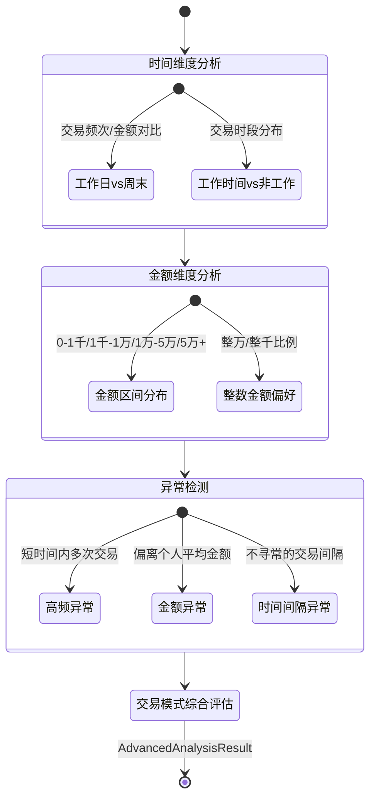

# 高级分析 - 四层设计

> 所属模块：分析引擎 | 实现位置：`src/analysis/advanced.py`
> 原参考：`original_ref/src/utils/advanced_analysis.py`

---

## 模块内部状态

```python
from pydantic import BaseModel
from typing import List

class AdvancedAnalysisResult(BaseModel):
    """高级分析结果"""
    时间模式: List[dict]            # 工作日vs周末、工作时间vs非工作时间
    金额模式: List[dict]            # 金额区间分布、整数金额偏好
    异常交易: List[dict]            # 高频/金额异常/时间间隔异常
    交易模式: List[dict]            # 个人交易模式分析
```

---

## 四层设计

| 层面 | 设计内容 |
|-----|---------|
| **数据规矩** | `AdvancedAnalysisResult`(Pydantic)：含时间模式/金额模式/异常交易/交易模式4个子列表，每个为List[dict]。阈值配置存入 `config/thresholds.json` |
| **数据存储** | 结果存入 `AnalysisResult.advanced`，键为 `{本方姓名: AdvancedAnalysisResult}` |
| **数据流转** | 时间维度分析 → 金额维度分析 → 异常检测 → 个人交易模式综合评估 |

**高级分析流转图**：


| **接口层** | `AdvancedAnalyzer.analyze(all_data, config) → Dict[str, AdvancedAnalysisResult]` |

---

## 对外接口契约

```python
from typing import Protocol, Dict

class AdvancedAnalyzer(Protocol):
    """高级分析器接口"""
    
    def analyze(self, all_data: Dict[str, "DataFrame"], config: dict) -> Dict[str, AdvancedAnalysisResult]:
        """
        执行高级分析
        Args:
            all_data: 标准化数据（按平台分组）
            config: 含金额区间、频率阈值等配置
        Returns:
            {本方姓名: AdvancedAnalysisResult}
        """
        ...
```

---

## 精确算法规则

### 时间模式分析

**工作日vs周末**：
- 工作日：周一至周五
- 周末：周六、周日
- 统计：工作日交易数、周末交易数、工作日占比

**工作时间vs非工作时间**：
- 工作时间：9:00-17:00
- 非工作时间：17:00-9:00
- 统计：工作时间交易数、非工作时间交易数、工作时间占比

**活跃时段**：按小时统计交易次数，取TOP5

**活跃月份**：按月统计交易次数

---

### 金额模式分析

**金额区间**（存入 `config/thresholds.json`）：

| 区间名 | 最小 | 最大 |
|-------|------|------|
| 小额 | 0 | 1,000 |
| 中额 | 1,000 | 10,000 |
| 大额 | 10,000 | 100,000 |
| 巨额 | 100,000 | 999,999,999 |

**整数金额偏好**：
- 整百金额占比：`|金额| % 100 == 0` 的交易比例
- 整千金额占比：`|金额| % 1000 == 0` 的交易比例
- 整万金额占比：`|金额| % 10000 == 0` 的交易比例

---

### 异常交易检测

**高频交易**：交易次数 > 10（频率阈值）
- 风险等级：>20 → 高，>15 → 中，其他 → 低

**金额异常**：Z-score > 3（标准差阈值）的离群值
- 风险等级：高

**时间间隔异常**：连续交易间隔 < 1小时
- 风险等级：中

---

### 个人交易模式分析

| 指标 | 计算方式 | 分级 |
|------|---------|------|
| 整数金额偏好 | 整数金额比例 | >0.8→强，>0.5→中，≤0.5→弱 |
| 时间规律性 | 规律时间间隔比例 | >0.8→强，>0.5→中，≤0.5→弱 |
| 金额稳定性 | 变异系数(CV) | <0.5→稳定，<1.0→一般，≥1.0→波动大 |
| 活跃度 | 交易次数 | >50→高，>20→中，≤20→低 |

**行为特征描述**：
- 整数金额偏好 > 0.8 → "偏好整数金额"
- 有规律时间间隔 → "每N天交易"
- 平均金额 > 50000 → "大额交易为主"
- 平均金额 < 1000 → "小额交易为主"
- 变异系数 < 0.3 → "金额稳定"
- 变异系数 > 2.0 → "金额波动大"
