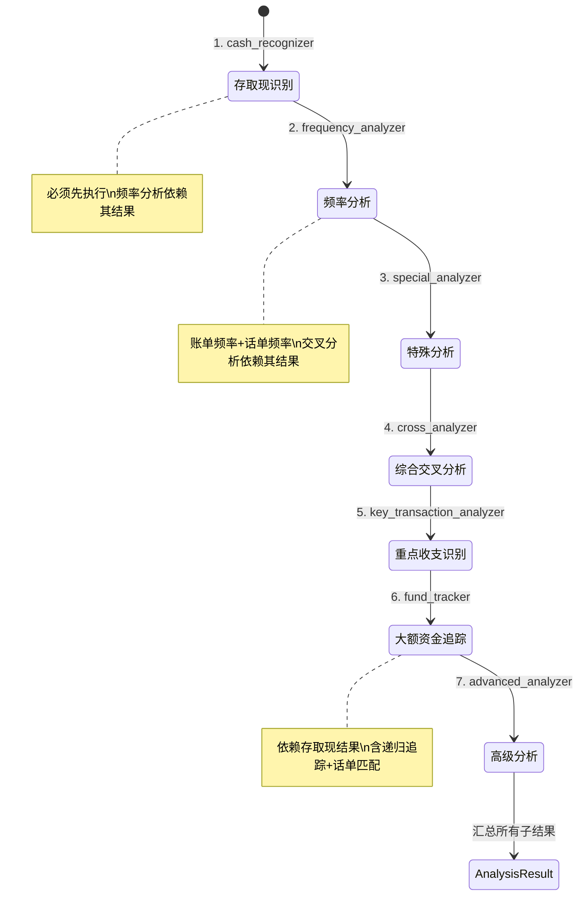

# 分析引擎 - 四层设计

> 所属项目：多源数据分析系统 | 源码参考：`original_ref/src/analysis/` + `original_ref/src/utils/`

---

## 模块内部状态

```python
from typing import TypedDict, Optional, List, Dict
from datetime import date, datetime
from pydantic import BaseModel

class CashRecognitionItem(BaseModel):
    """存取现识别结果"""
    index: int                      # 原始数据行索引
    cash_type: str                  # '存现' | '取现' | '转账'
    confidence: float               # 置信度 0-1
    reason: str                     # 识别原因

class FrequencyItem(BaseModel):
    """频率分析结果"""
    platform: str                   # 平台名
    data_source: str                # 数据来源文件名
    本方姓名: str
    对方姓名: str
    收入总额: float
    支出总额: float
    交易次数: int
    交易总金额: float
    交易时间跨度: Optional[int]     # 天数

class CallFrequencyItem(BaseModel):
    """话单频率分析结果"""
    platform: str                   # 固定"话单"
    data_source: str
    本方姓名: str
    对方姓名: str
    对方号码: str
    对方单位名称: Optional[str]
    对方职务: Optional[str]
    通话次数: int
    主叫次数: int
    被叫次数: int
    通话总时长秒: float
    通话总时长分钟: float
    通话占比: Optional[str]         # 百分比字符串
    特殊时间次数: int

class CrossAnalysisItem(BaseModel):
    """综合交叉分析结果"""
    分析基准: str
    本方姓名: str
    对方姓名: str
    对方号码: Optional[str]
    对方单位名称: Optional[str]
    对方职务: Optional[str]
    通话次数: Optional[int]
    通话总时长: Optional[float]
    收入总额: Optional[float]
    支出总额: Optional[float]
    交易次数: Optional[int]
    平台: Optional[str]
    平台金额分布: Optional[str]
    银行_收入总额: Optional[float]
    银行_支出总额: Optional[float]
    银行_交易次数: Optional[int]
    微信_收入总额: Optional[float]
    微信_支出总额: Optional[float]
    微信_交易次数: Optional[int]
    支付宝_收入总额: Optional[float]
    支付宝_支出总额: Optional[float]
    支付宝_交易次数: Optional[int]

class KeyTransactionItem(BaseModel):
    """重点收支识别结果"""
    index: int
    本方姓名: str
    交易日期: date
    交易金额: float
    交易方向: str                   # '收入' | '支出'
    重点类型: str                   # '工作收入'|'资产收入'|'资产支出'|'大额收入'|'大额支出'
    重点子类: str                   # '工资奖金'|'房产'|'租金'|'车辆收入'等
    匹配关键词: str
    置信度: float

class SpecialDateItem(BaseModel):
    """特殊日期分析结果"""
    index: int
    交易日期: date
    特殊日期名称: str               # '春节'|'情人节'等

class SpecialAmountItem(BaseModel):
    """特殊金额分析结果"""
    index: int
    交易金额: float
    特殊类型: str                   # '爱情数字'|'其他特殊金额'
    特殊金额名: str                 # '520'|'1314'等

class FundTrackingItem(BaseModel):
    """大额资金追踪结果"""
    分析类型: str                   # '大额资金追踪'|'存取现话单匹配'
    追踪层级: int                   # 0=直接, 1=间接第一层, 2=间接第二层
    核心人员: str
    关联人员: str
    交易日期: Optional[date]
    交易金额: Optional[float]
    交易方向: str                   # '收入'|'支出'|'汇总'
    大额级别: Optional[str]         # '5万-10万'|'10万-50万'等
    数据来源: Optional[str]
    资金流向: str                   # '直接交易'|'间接追踪'|'月度汇总'
    追踪说明: str
    月份: Optional[str]             # YYYY-MM
    # 话单匹配字段（仅存取现话单匹配时有值）
    通话日期: Optional[date]
    通话对方: Optional[str]
    通话对方单位: Optional[str]

class AdvancedAnalysisResult(BaseModel):
    """高级分析结果"""
    时间模式: List[dict]            # 工作日vs周末、工作时间vs非工作时间
    金额模式: List[dict]            # 金额区间分布、整数金额偏好
    异常交易: List[dict]            # 高频/金额异常/时间间隔异常
    交易模式: List[dict]            # 个人交易模式分析

class AnalysisResult(BaseModel):
    """分析引擎总结果 - 所有子分析的统一输出"""
    # 基础数据
    persons: List[str]              # 所有本方姓名
    data_sources: Dict[str, str]    # 已加载的数据源类型→文件路径
    
    # 子分析结果
    cash_recognition: Dict[str, List[CashRecognitionItem]]   # {本方姓名: [识别结果]}
    frequency: Dict[str, List[FrequencyItem]]                # {平台: [频率结果]}
    call_frequency: List[CallFrequencyItem]                  # 话单频率
    cross_analysis: Dict[str, List[CrossAnalysisItem]]       # {基准: [交叉结果]}
    key_transactions: Dict[str, List[KeyTransactionItem]]    # {本方姓名: [重点收支]}
    special_dates: Dict[str, List[SpecialDateItem]]          # {本方姓名: [特殊日期]}
    special_amounts: Dict[str, List[SpecialAmountItem]]      # {本方姓名: [特殊金额]}
    fund_tracking: List[FundTrackingItem]                    # 大额资金追踪
    cash_call_match: List[FundTrackingItem]                  # 存取现话单匹配
    advanced: Dict[str, AdvancedAnalysisResult]              # {本方姓名: 高级分析}
    
    # 统计摘要
    bank_cash_deposit_total: Dict[str, float]                # {本方姓名: 存现总额}
    bank_cash_withdrawal_total: Dict[str, float]             # {本方姓名: 取现总额}
```

---

## 四层设计

| 层面 | 设计内容 |
|-----|---------|
| **数据规矩** | `AnalysisResult`(Pydantic)：结构化分析结果，含10个子结果模块。所有子结果均为Pydantic模型，字段类型和约束已定义 |
| **数据存储** | AnalysisResult对象内存存储；可选pickle缓存；各子分析器返回值存入AnalysisResult对应字段 |
| **数据流转** | `engine.analyze(state) → AnalysisResult`；各子分析器接收StandardData，返回子结果；引擎编排子分析器执行顺序 |

**分析编排流程图**：


| **接口层** | `AnalysisEngine.analyze(state, type) → AnalysisResult`；各子分析器标准接口 `analyze(data, config) → SubResult` |

---

## 对外接口契约

```python
from typing import Protocol

class AnalysisEngine(Protocol):
    """分析引擎统一接口"""
    
    def analyze(self, state: "AnalysisState", analysis_type: str = 'all') -> AnalysisResult:
        """
        执行分析
        Args:
            state: 全局状态（含已加载数据）
            analysis_type: 分析类型 'all'|'frequency'|'cash'|'special'|'cross'|'key_transaction'|'fund_tracking'|'advanced'
        Returns:
            AnalysisResult: 结构化分析结果
        """
        ...

class SubAnalyzer(Protocol):
    """子分析器标准接口"""
    
    def analyze(self, data: dict, config: dict) -> list:
        """
        执行子分析
        Args:
            data: 标准化数据（按平台分组）
            config: 分析配置
        Returns:
            子分析结果列表
        """
        ...
```

---

## 子模块划分

| 子模块 | 实现位置 | 职责 | 深入？ |
|-------|---------|------|-------|
| **存取现识别** | `src/analysis/cash_recognition.py` | 三级优先级递进识别存现/取现/转账 | ✅ → [[05-01-存取现识别-四层设计]] |
| **频率分析** | `src/analysis/frequency.py` | 账单类和话单类频率聚合 | ✅ → [[05-02-频率分析-四层设计]] |
| **综合交叉分析** | `src/analysis/cross_analysis.py` | 多数据源交叉关联 | ✅ → [[05-03-综合交叉分析-四层设计]] |
| **特殊分析** | `src/analysis/special_analysis.py` | 特殊日期/金额/整数金额识别 | ✅ → [[05-04-特殊分析-四层设计]] |
| **重点收支识别** | `src/analysis/key_transaction.py` | 工作收入/房产/租金/车辆/证券/大额识别 | ✅ → [[05-05-重点收支识别-四层设计]] |
| **大额资金追踪** | `src/analysis/fund_tracking.py` | 大额交易筛选+递归追踪+存取现话单匹配 | ✅ → [[05-06-大额资金追踪-四层设计]] |
| **高级分析** | `src/analysis/advanced.py` | 时间模式/金额模式/异常检测/交易模式 | ✅ → [[05-07-高级分析-四层设计]] |

---

## 分析引擎编排

```python
class AnalysisEngine:
    """分析引擎 - 编排所有子分析器"""
    
    def __init__(self, config: dict):
        self.config = config
        self.cash_recognizer = CashRecognizer(config)
        self.frequency_analyzer = FrequencyAnalyzer(config)
        self.special_analyzer = SpecialAnalyzer(config)
        self.cross_analyzer = CrossAnalyzer(config)
        self.key_transaction_analyzer = KeyTransactionAnalyzer(config)
        self.fund_tracker = FundTracker(config)
        self.advanced_analyzer = AdvancedAnalyzer(config)
    
    def analyze(self, state: AnalysisState, analysis_type: str = 'all') -> AnalysisResult:
        """执行分析 - 按依赖顺序编排子分析器"""
        # 1. 存取现识别（必须在频率分析之前，因为频率只统计转账）
        cash_result = self.cash_recognizer.analyze(state.bank_data)
        
        # 2. 频率分析（依赖存取现结果，只统计转账记录）
        freq_result = self.frequency_analyzer.analyze(state.all_data)
        call_freq_result = self.frequency_analyzer.analyze_calls(state.call_data)
        
        # 3. 特殊日期/金额分析
        special_result = self.special_analyzer.analyze(state.all_data)
        
        # 4. 综合交叉分析（依赖频率结果）
        cross_result = self.cross_analyzer.analyze(freq_result, call_freq_result)
        
        # 5. 重点收支识别
        key_result = self.key_transaction_analyzer.analyze(state.all_data)
        
        # 6. 大额资金追踪（依赖存取现结果）
        fund_result = self.fund_tracker.analyze(state.all_data, cash_result)
        
        # 7. 高级分析
        advanced_result = self.advanced_analyzer.analyze(state.all_data)
        
        return AnalysisResult(
            cash_recognition=cash_result,
            frequency=freq_result,
            call_frequency=call_freq_result,
            cross_analysis=cross_result,
            key_transactions=key_result,
            special_dates=special_result.dates,
            special_amounts=special_result.amounts,
            fund_tracking=fund_result.tracking,
            cash_call_match=fund_result.cash_call_match,
            advanced=advanced_result,
        )
```
