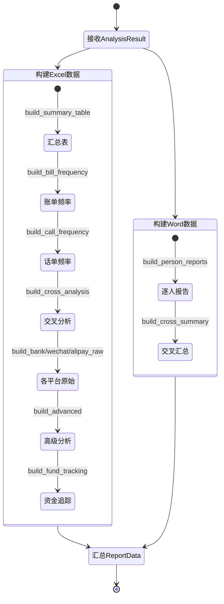

# 报告构建器 - 四层设计

> 所属模块：导出引擎 | 实现位置：`src/export/report_builder.py`

---

## 模块内部状态

```python
# ReportData 和 PersonReportData 定义见 [[06-导出引擎-四层设计]]
```

---

## 四层设计

| 层面 | 设计内容 |
|-----|---------|
| **数据规矩** | 输入：`AnalysisResult`（来自 [[05-分析引擎-四层设计]]）；输出：`ReportData`(Pydantic)。ReportData含Excel数据(9张表)和Word数据(每人一份) |
| **数据存储** | 内存中构建ReportData对象，传递给导出器后释放 |
| **数据流转** | `AnalysisResult → build_summary_table → build_bill_frequency → build_call_frequency → build_cross_analysis → build_*_raw → build_advanced → build_fund_tracking → build_person_reports → ReportData` |

**报告构建流转图**：


| **接口层** | `ReportBuilder.build(analysis_result) → ReportData` |

---

## 对外接口契约

```python
from typing import Protocol

class ReportBuilder(Protocol):
    """报告数据构建器 - 将分析结果转换为导出器可消费的ReportData"""
    
    def build(self, analysis_result: "AnalysisResult") -> "ReportData":
        """构建报告数据"""
        ...
```

---

## 精确构建逻辑

### ReportBuilder 实现

```python
class ReportBuilder:
    """报告数据构建器 - 将分析结果转换为导出器可消费的ReportData"""
    
    def build(self, analysis_result: AnalysisResult) -> ReportData:
        """构建报告数据"""
        # 1. 构建Excel数据
        summary_table = self._build_summary_table(analysis_result)
        bill_frequency = self._build_bill_frequency(analysis_result)
        call_frequency = self._build_call_frequency(analysis_result)
        cross_analysis = self._build_cross_analysis(analysis_result)
        bank_raw = self._build_bank_raw(analysis_result)
        wechat_raw = self._build_wechat_raw(analysis_result)
        alipay_raw = self._build_alipay_raw(analysis_result)
        advanced_analysis = self._build_advanced(analysis_result)
        fund_tracking = self._build_fund_tracking(analysis_result)
        
        # 2. 构建Word数据（每人一份）
        person_reports = {}
        for person in analysis_result.persons:
            person_reports[person] = self._build_person_report(person, analysis_result)
        
        # 3. 构建综合交叉分析汇总
        cross_summary = self._build_cross_summary(analysis_result)
        
        return ReportData(
            persons=analysis_result.persons,
            data_types=list(analysis_result.data_sources.keys()),
            bank_names=self._extract_bank_names(analysis_result),
            summary_table=summary_table,
            bill_frequency=bill_frequency,
            call_frequency=call_frequency,
            cross_analysis=cross_analysis,
            bank_raw=bank_raw,
            wechat_raw=wechat_raw,
            alipay_raw=alipay_raw,
            advanced_analysis=advanced_analysis,
            fund_tracking=fund_tracking,
            person_reports=person_reports,
            cross_analysis_summary=cross_summary,
        )
```

---

### 分析汇总表构建逻辑

- 对银行数据，按"本方姓名"聚合存取现和转账金额
- 对微信/支付宝数据，按"本方姓名"聚合收入和支出金额
- 每个平台每个人生成3行（存现汇总、取现汇总、转账汇总）

### 单人报告数据构建逻辑

对每个"本方姓名"，从 `AnalysisResult` 各子结果中提取并计算：

| 内容项 | 数据来源 | 计算逻辑 |
|-------|---------|---------|
| 银行总进账 | 银行频率分析 | `收入金额` 求和 |
| 银行总出账 | 银行频率分析 | `支出金额` 求和 |
| 微信总进账 | 微信频率分析 | `收入金额` 求和 |
| 微信总出账 | 微信频率分析 | `支出金额` 求和 |
| 支付宝总进账 | 支付宝频率分析 | `收入金额` 求和 |
| 支付宝总出账 | 支付宝频率分析 | `支出金额` 求和 |
| 时间跨度 | 全部交易 | `MIN(交易日期) ~ MAX(交易日期)` |
| 账户余额 | 银行原始数据 | 按日期排序取最后一条的 `账户余额` |
| 最常用银行 | 银行原始数据 | 按银行名称统计交易次数最多的银行 |
| 存现总额 | 存取现识别 | `存取现标识=='存现'` 的 `收入金额` 求和 |
| 取现总额 | 存取现识别 | `存取现标识=='取现'` 的 `支出金额` 求和 |
| 纯收入对手 | 频率分析 | `收入总额 > 0 AND 支出总额 == 0` 的对方 |
| 纯支出对手 | 频率分析 | `支出总额 > 0 AND 收入总额 == 0` 的对方 |
| 爱情数字交易 | 特殊金额分析 | `特殊类型=='爱情数字'` 的交易 |
| 特殊日期交易 | 特殊日期分析 | 匹配到特殊日期的交易 |
| 工作收入 | 重点收支 | `重点类型=='工作收入'` 的交易汇总 |
| 房产/租金/车辆/证券 | 重点收支 | 对应类型的交易汇总 |
| 存取现话单匹配 | 大额资金追踪 | `分析类型=='存取现话单匹配'` |
| 大额资金跟踪层级 | 大额资金追踪 | `分析类型=='大额资金追踪'` |
