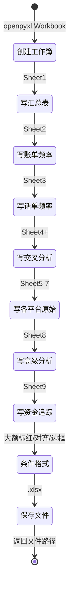

# Excel导出 - 四层设计

> 所属模块：导出引擎 | 实现位置：`src/export/excel_exporter.py`

---

## 模块内部状态

```python
# ExportConfig 定义见 [[06-导出引擎-四层设计]]
# Excel导出器无额外内部状态，仅依赖 ReportData 和 ExportConfig
```

---

## 四层设计

| 层面 | 设计内容 |
|-----|---------|
| **数据规矩** | 输入：`ReportData`(Pydantic) + `ExportConfig`(Pydantic)；输出：`.xlsx`文件路径(str)。9个工作表，每个工作表列规格已精确定义 |
| **数据存储** | 文件系统（.xlsx），使用 openpyxl 写入 |
| **数据流转** | `ReportData → 创建工作簿 → 逐表写入数据 → 条件格式 → 保存文件 → 返回路径` |

**Excel导出流转图**：


| **接口层** | `ExcelExporter.export(report_data, config) → str` |

---

## 对外接口契约

```python
from typing import Protocol

class ExcelExporter(Protocol):
    """Excel报告导出器接口"""
    
    def export(self, report_data: "ReportData", config: "ExportConfig") -> str:
        """
        导出Excel报告
        Args:
            report_data: 报告数据（来自 [[06-01-报告构建器-四层设计]]）
            config: 导出配置
        Returns:
            输出文件路径
        """
        ...
```

---

## 工作表精确规格

### 工作表1：分析汇总表

**定位**：报告第一个工作表，提供全局概览

| 列名 | 数据类型 | 数据来源 | 生成逻辑 |
|------|---------|---------|---------|
| 分析类型 | str | 固定值 | "存现汇总"/"取现汇总"/"转账汇总" |
| 平台 | str | 数据源标识 | "银行"/"微信"/"支付宝" |
| 本方姓名 | str | 原始数据 | 被分析人姓名 |
| 存现金额 | float | 存取现识别 | 仅存现汇总行有值，按本方姓名聚合 |
| 取现金额 | float | 存取现识别 | 仅取现汇总行有值，按本方姓名聚合 |
| 转入金额 | float | 频率分析 | 仅转账汇总行有值，即收入总额 |
| 转出金额 | float | 频率分析 | 仅转账汇总行有值，即支出总额 |

**列顺序**：`分析类型 | 平台 | 本方姓名 | 存现金额 | 取现金额 | 转入金额 | 转出金额`

**生成逻辑**：
- 对银行数据，按"本方姓名"聚合存取现和转账金额
- 对微信/支付宝数据，按"本方姓名"聚合收入和支出金额
- 每个平台每个人生成3行（存现汇总、取现汇总、转账汇总）

---

### 工作表2：账单类频率表

**定位**：银行+微信+支付宝的转账频率分析合并表

| 列名 | 数据类型 | 数据来源 | 生成逻辑 |
|------|---------|---------|---------|
| 平台 | str | 数据源标识 | "银行"/"微信"/"支付宝" |
| 数据来源 | str | 文件名 | 具体文件名 |
| 本方姓名 | str | 原始数据 | 被分析人 |
| 对方姓名 | str | 原始数据 | 交易对手 |
| 收入总额 | float | 频率分析 | 与该对手的收入交易总额 |
| 支出总额 | float | 频率分析 | 与该对手的支出交易总额 |
| 交易次数 | int | 频率分析 | 总交易次数 |
| 交易总金额 | float | 频率分析 | 收入+支出的绝对值总额 |
| 收入占比 | str | 计算值 | `收入总额/全表收入总额*100`，保留2位小数+"%" |
| 支出占比 | str | 计算值 | `支出总额/全表支出总额*100`，保留2位小数+"%" |

**列顺序**：`平台 | 数据来源 | 本方姓名 | 对方姓名 | 收入总额 | 支出总额 | 交易次数 | 交易总金额 | 收入占比 | 支出占比`

**排序**：`本方姓名 ASC, 交易总金额 DESC`

---

### 工作表3：话单类频率表

| 列名 | 数据类型 | 生成逻辑 |
|------|---------|---------|
| 平台 | str | 固定"话单" |
| 数据来源 | str | 文件名 |
| 本方姓名 | str | 被分析人 |
| 对方姓名 | str | 通话对方 |
| 对方号码 | str | 对方电话号码 |
| 对方单位名称 | str | 对方单位 |
| 对方职务 | str | 对方职务 |
| 通话次数 | int | 总通话次数 |
| 主叫次数 | int | 被分析人主叫次数 |
| 被叫次数 | int | 被分析人被叫次数 |
| 通话总时长(秒) | float | 总通话秒数 |
| 通话总时长(分钟) | float | 秒数/60 |
| 通话占比 | str | `通话次数/全表*100`+"%" |
| 特殊时间次数 | int | 特殊日期内通话次数 |

**列顺序**：`平台 | 数据来源 | 本方姓名 | 对方姓名 | 对方号码 | 对方单位名称 | 对方职务 | 通话次数 | 主叫次数 | 被叫次数 | 通话总时长(秒) | 通话总时长(分钟) | 通话占比 | 特殊时间次数`

**排序**：`本方姓名 ASC, 通话次数 DESC`

---

### 工作表4：综合分析表

**定位**：多数据源交叉关联分析结果，报告核心

| 列名 | 数据类型 | 生成逻辑 |
|------|---------|---------|
| 分析基准 | str | "以话单为基准"/"以银行为基准"等 |
| 本方姓名 | str | 被分析人 |
| 对方姓名 | str | 关联对手 |
| 对方号码 | str | 对方号码（话单补充） |
| 对方单位名称 | str | 对方单位（话单补充） |
| 对方职务 | str | 对方职务（话单补充） |
| 通话次数 | int | 话单基准时有值 |
| 通话总时长(分钟) | float | 话单基准时有值 |
| 收入总额 | float | 账单基准时有值 |
| 支出总额 | float | 账单基准时有值 |
| 交易次数 | int | 账单基准时有值 |
| 平台 | str | 匹配到的数据源列表 |
| 平台金额分布 | str | 各平台金额分布描述 |
| 银行_收入总额 | float | 银行交叉匹配 |
| 银行_支出总额 | float | 银行交叉匹配 |
| 银行_交易次数 | int | 银行交叉匹配 |
| 微信_收入总额 | float | 微信交叉匹配 |
| 微信_支出总额 | float | 微信交叉匹配 |
| 微信_交易次数 | int | 微信交叉匹配 |
| 支付宝_收入总额 | float | 支付宝交叉匹配 |
| 支付宝_支出总额 | float | 支付宝交叉匹配 |
| 支付宝_交易次数 | int | 支付宝交叉匹配 |

**列顺序**：`分析基准 | 本方姓名 | 对方姓名 | 对方号码 | 对方单位名称 | 对方职务 | 通话次数 | 通话总时长(分钟) | 收入总额 | 支出总额 | 交易次数 | 平台 | 平台金额分布 | 银行_收入总额 | 银行_支出总额 | 银行_交易次数 | 微信_收入总额 | 微信_支出总额 | 微信_交易次数 | 支付宝_收入总额 | 支付宝_支出总额 | 支付宝_交易次数`

**平台金额分布格式**：`"银行(收入X元,支出Y元); 微信(收入X元,支出Y元); 支付宝(收入X元,支出Y元)"`

---

### 工作表5-7：银行/微信/支付宝分析原始

**银行分析原始列**：

| 列名 | 生成逻辑 |
|------|---------|
| 分析类型 | 原始表标记：`转账数据|存现数据|取现数据|特殊金额|整百数金额|特殊日期|重点收入|重点支出` |
| 交易日期 | 交易发生日期 |
| 交易时间 | 交易发生时间 |
| 本方姓名 | 被分析人 |
| 本方账号 | 被分析人银行账号 |
| 对方姓名 | 交易对手 |
| 对方账号 | 交易对手账号 |
| 交易金额 | 交易金额绝对值 |
| 借贷标识 | 借/贷 |
| 收入金额 | 收入金额 |
| 支出金额 | 支出金额 |
| 账户余额 | 交易后余额 |
| 交易类型 | 交易类型描述 |
| 交易摘要 | 交易摘要信息 |
| 交易备注 | 交易备注信息 |
| 存取现标识 | "存现"/"取现"/"转账" |
| 银行类型 | 银行名称 |
| 数据来源 | 来源文件名 |
| 特殊日期名称 | 若在特殊日期则标注节日名 |

**列顺序**：`分析类型 | 交易日期 | 交易时间 | 本方姓名 | 本方账号 | 对方姓名 | 对方账号 | 交易金额 | 借贷标识 | 收入金额 | 支出金额 | 账户余额 | 交易类型 | 交易摘要 | 交易备注 | 存取现标识 | 银行类型 | 数据来源 | 特殊日期名称`

**微信/支付宝原始列**：结构类似银行，字段名称根据平台适配，**无**存取现标识列和账户余额列。分析类型：`转账数据|特殊金额|整百数金额|特殊日期|重点收入|重点支出`

---

### 工作表8：高级分析表

**分析结果子表**：

| 列名 | 生成逻辑 |
|------|---------|
| 姓名 | 被分析人 |
| 分析类型 | "工作日vs周末"/"工作时间vs非工作时间"/"金额区间分布"/"整数金额偏好"/"一天中的活跃时段"/"一年中的活跃月份" |
| 具体指标 | 指标名称 |
| 数值 | 格式化后的指标值 |
| 说明 | 通俗易懂的指标说明 |

**异常交易检测子表**：

| 列名 | 生成逻辑 |
|------|---------|
| 序号 | 异常编号 |
| 异常类型 | 高频交易/金额异常/时间间隔异常 |
| 涉及人员 | 人员姓名 |
| 异常详情 | 具体异常描述 |
| 风险等级 | 高/中/低 |
| 说明 | 风险说明 |

**个人交易模式子表**：

| 列名 | 生成逻辑 |
|------|---------|
| 姓名 | 人员姓名 |
| 交易次数 | 总交易次数 |
| 平均金额 | 平均交易金额 |
| 整数金额偏好 | 强/中/弱（占比） |
| 时间规律性 | 强/中/弱（占比） |
| 金额稳定性 | 稳定/一般/波动大（变异系数） |
| 活跃度 | 高/中/低 |
| 行为特征 | 特征描述 |

---

### 工作表9：大额资金跟踪表

| 列名 | 数据类型 | 生成逻辑 |
|------|---------|---------|
| 分析类型 | str | "大额资金追踪"/"存取现话单匹配" |
| 追踪层级 | int | 0=直接交易，1=间接第一层，2=间接第二层 |
| 核心人员 | str | 资金追踪的起点人员 |
| 关联人员 | str | 与核心人员有关联的人员 |
| 交易日期 | datetime | 交易发生日期 |
| 交易金额 | float | 交易金额 |
| 交易方向 | str | "收入"/"支出" |
| 大额级别 | str | "5万-10万"/"10万-50万"/"50万-100万"/"100万及以上" |
| 数据来源 | str | 来源文件名+银行名 |
| 资金流向 | str | "直接交易"/"间接追踪"/"月度汇总" |
| 追踪说明 | str | "直接交易追踪"/"间接追踪第N层" |
| 月份 | str | YYYY-MM格式 |
| 通话日期 | datetime | 存取现话单匹配时的通话日期 |
| 通话对方 | str | 存取现话单匹配时的通话对方 |
| 通话对方单位 | str | 存取现话单匹配时的对方单位 |

**列顺序**：`分析类型 | 追踪层级 | 核心人员 | 关联人员 | 交易日期 | 交易金额 | 交易方向 | 大额级别 | 数据来源 | 资金流向 | 追踪说明 | 月份 | 通话日期 | 通话对方 | 通话对方单位`

---

### Excel条件格式

- **大额标红**：`交易金额 >= 50000` 的行整行标红（背景色）
- **存取现标识列**：存现/取现行高亮
