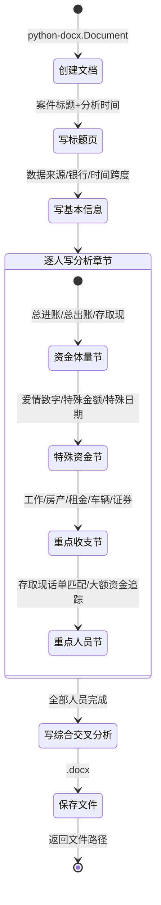

# Word导出 - 四层设计

> 所属模块：导出引擎 | 实现位置：`src/export/word_exporter.py`

---

## 模块内部状态

```python
# ExportConfig / PersonReportData 定义见 [[06-导出引擎-四层设计]]
# Word导出器无额外内部状态，仅依赖 ReportData 和 ExportConfig
```

---

## 四层设计

| 层面 | 设计内容 |
|-----|---------|
| **数据规矩** | 输入：`ReportData`(Pydantic) + `ExportConfig`(Pydantic)；输出：`.docx`文件路径(str)。按人员分章节，每人4节（资金体量/特殊资金/重点收支/重点人员） |
| **数据存储** | 文件系统（.docx），使用 python-docx 写入 |
| **数据流转** | `ReportData → 创建文档 → 写标题/基本信息 → 逐人写分析章节 → 写综合交叉分析 → 保存文件` |

**Word导出流转图**：


| **接口层** | `WordExporter.export(report_data, config) → str` |

---

## 对外接口契约

```python
from typing import Protocol

class WordExporter(Protocol):
    """Word报告导出器接口"""
    
    def export(self, report_data: "ReportData", config: "ExportConfig") -> str:
        """
        导出Word报告
        Args:
            report_data: 报告数据（来自 [[06-01-报告构建器-四层设计]]）
            config: 导出配置
        Returns:
            输出文件路径
        """
        ...
```

---

## Word报告精确规格（新版结构）

### 版本说明

- **旧版报告**：按"基本信息 → 个人详细分析 → 综合交叉分析"结构
- **新版报告**：按人员分组，每人包含"资金体量 → 特殊资金 → 重点收支 → 重点人员"四大板块
- **重构后统一版本**：采用新版结构（更符合纪委监委初核工作需要），通过配置支持旧版切换

---

### 报告标题与基本信息

**标题**：`{被分析人姓名}线索技术分析报告`（居中，一级标题）

**基本信息节**（二级标题）：

| 内容项 | 数据来源 | 生成逻辑 |
|-------|---------|---------|
| 被分析人姓名列表 | 数据中所有"本方姓名" | 去重后的姓名列表 |
| 使用的数据类型 | 已加载的数据源 | 银行/微信/支付宝/话单 |
| 涉及银行名称 | 银行数据中的"银行类型"列 | 去重后的银行列表 |

---

### 每人分析章节（核心）

对每个"本方姓名"生成一个**二级标题**章节，包含以下四节：

#### 第一节：资金体量（三级标题）

**1. 总资金体量**：

| 内容项 | 精确计算逻辑 |
|-------|-------------|
| 银行总进账 | 银行数据 `收入金额` 列求和 |
| 银行总出账 | 银行数据 `支出金额` 列求和 |
| 微信总进账 | 微信数据 `收入金额` 列求和（借贷标识='入'的记录） |
| 微信总出账 | 微信数据 `支出金额` 列求和（借贷标识='出'的记录） |
| 支付宝总进账 | 支付宝数据 `收入金额` 列求和（借贷标识='收入'的记录） |
| 支付宝总出账 | 支付宝数据 `支出金额` 列求和（借贷标识='支出'的记录） |
| 时间跨度 | `MIN(交易日期) ~ MAX(交易日期)` |
| 账户余额 | 按日期排序取最后一条记录的 `账户余额` |
| 最常用银行 | 按银行名称统计交易次数最多的银行 |

**2. 活跃时间和交易对手**：
- 各平台资金总量前三的年份：按年汇总交易金额，取TOP3
- 交易资金总量的对手前三名：按对方姓名汇总交易金额，取TOP3

**3. 存取现和大额资金**：
- 存现总额：`存取现标识=='存现'` 的 `收入金额` 求和
- 取现总额：`存取现标识=='取现'` 的 `支出金额` 求和
- 单笔1万以上存取现：`存取现标识 IN ('存现','取现') AND |交易金额| >= 10000`，统计次数和金额
- 银行总转账金额：`存取现标识=='转账'` 的 `|交易金额|` 求和
- 单笔5万以上转账：`存取现标识=='转账' AND |交易金额| >= 50000`，统计次数和金额

---

#### 第二节：特殊资金分析（三级标题）

**1. 纯进、出账统计**：
- 纯收入对手：频率分析中 `收入总额 > 0 AND 支出总额 == 0` 的对方，按收入金额排序取前5名
- 纯支出对手：频率分析中 `支出总额 > 0 AND 收入总额 == 0` 的对方，按支出金额排序取前5名

**2. 特殊金额统计**：
- 爱情数字交易：`|交易金额| IN [520, 521, 1314, 13140, 131400, 5200, 52000, 520000, 52.0, 13.14]`，列出每笔交易的日期、金额、对方
- 其他特殊金额交易：`|交易金额| IN [6.66, 8.88, 66, 88, 99, 166, 188, ...]`，列出每笔交易明细
- 特殊金额交易对手：对应交易的对方姓名

**3. 特殊日期统计**：
- 特殊日期内的交易明细（含日期、金额、对方、特殊日期名称）
- 特殊日期交易金额汇总
- 特殊日期交易对手

---

#### 第三节：重点收支（三级标题）

**匹配文本** = 交易摘要 + 交易备注 + 交易类型 + 对方姓名（空格分隔）

**1. 工作收支**：
- 工作收入总额：`是否工作收入==True AND 交易金额>0` 的金额求和
- 工作收入时间范围：首末笔工作收入的日期
- 疑似工作单位：工作收入交易的对方姓名（去重，最多3个）

**2. 房产车辆收支**：
- 房产收入总额：匹配房产关键词的收入合计
- 房产支出总额：匹配房产关键词的支出合计
- 房产交易时间范围：首末笔房产交易日期
- 房产交易对手：对应交易的对方姓名
- 车辆收入/支出总额：同理
- 租金收入/支出总额：同理

**3. 理财收入**：
- 证券收入总额/支出总额：匹配证券关键词的交易
- 其他理财收入：非证券类理财收入

---

#### 第四节：重点人员（三级标题）

**1. 存取现与话单匹配的人员**：

| 内容项 | 数据来源 |
|-------|---------|
| 存取现日期 | 银行存取现数据 |
| 存取现金额 | 银行存取现数据 |
| 当天通话对方姓名 | 话单数据（同日通话记录） |
| 当天通话对方单位 | 话单数据 |
| 通话日期 | 话单数据 |

**匹配逻辑**：银行存取现交易当日（金额≥1000），该人有通话记录的对方人员

**2. 大额资金跟踪与话单匹配的人员**：

| 内容项 | 数据来源 |
|-------|---------|
| 大额交易日期 | 大额资金追踪 |
| 大额交易金额 | 大额资金追踪 |
| 大额交易方向 | 大额资金追踪 |
| 当天通话对方姓名 | 话单数据（同日通话记录） |
| 当天通话对方单位 | 话单数据 |

**匹配逻辑**：大额资金交易（≥5万）当日，该人有通话记录的对方人员

**3. 大额资金跟踪层级区分的重点人员**：

| 追踪层级 | 含义 | 展示内容 |
|---------|------|---------|
| 层级0 | 直接交易对手 | 核心人员 → 关联人员，直接交易金额和日期 |
| 层级1 | 间接关联第一层 | 关联人员 → 其直接交易对手，追踪说明"通过XXX间接追踪" |
| 层级2 | 间接关联第二层 | 层级1人员的直接交易对手，追踪说明"通过XXX→YYY间接追踪" |

---

### 综合交叉分析章节（二级标题）

- 按本方姓名排序的综合分析表格（与Excel综合分析表相同数据）
- 多数据源关联度：话单+银行+微信+支付宝的交叉匹配统计
- 关联强度排名：按匹配数据源数量排序
