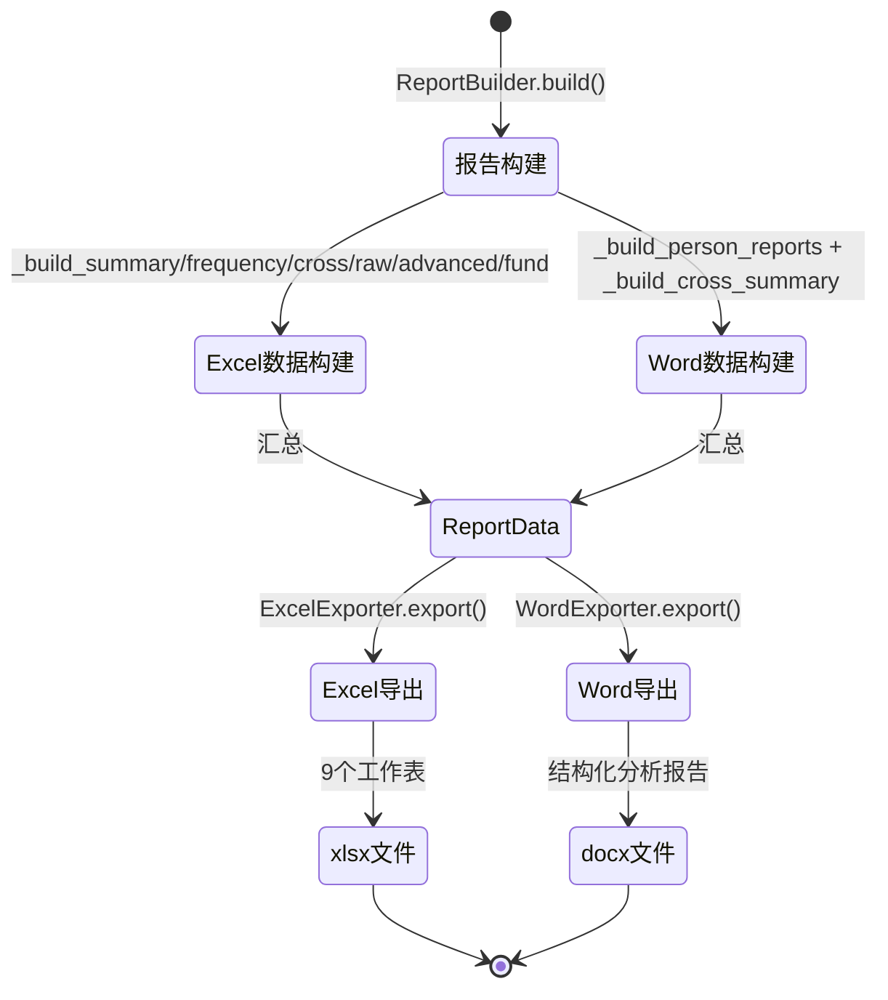

# 导出引擎 - 四层设计

> 所属项目：多源数据分析系统 | 源码参考：`original_ref/src/export/`

---

## 模块内部状态

```python
from typing import TypedDict, Optional, List, Dict
from pydantic import BaseModel

class ExportConfig(BaseModel):
    """导出配置"""
    output_dir: str                         # 输出目录
    excel_template: Optional[str]           # Excel模板路径（可选）
    word_template: Optional[str]            # Word模板路径（可选）
    report_version: str = "new"             # 报告版本：'new'(新版) | 'old'(旧版)
    highlight_large_amount: bool = True     # 是否高亮大额交易
    large_amount_threshold: float = 50000   # 大额标红阈值

class PersonReportData(BaseModel):
    """单人报告数据"""
    本方姓名: str
    
    # 资金体量
    银行总进账: float
    银行总出账: float
    微信总进账: float
    微信总出账: float
    支付宝总进账: float
    支付宝总出账: float
    时间跨度: str                           # "YYYY-MM-DD ~ YYYY-MM-DD"
    账户余额: Optional[float]
    最常用银行: Optional[str]
    
    # 活跃时间和交易对手
    各平台年度TOP3: Dict[str, List[dict]]   # {平台: [{年份, 金额}]}
    交易对手TOP3: List[dict]                # [{对方姓名, 总金额}]
    
    # 存取现和大额
    存现总额: float
    取现总额: float
    单笔万以上存取现: dict                  # {次数, 金额}
    银行总转账金额: float
    单笔5万以上转账: dict                   # {次数, 金额}
    
    # 纯进/出账
    纯收入对手: List[dict]                  # [{对方姓名, 金额}]
    纯支出对手: List[dict]
    
    # 特殊金额
    爱情数字交易: List[dict]                # [{日期, 金额, 对方}]
    其他特殊金额交易: List[dict]
    
    # 特殊日期
    特殊日期交易: List[dict]                # [{日期, 金额, 对方, 节日名}]
    
    # 重点收支
    工作收入: dict                          # {总额, 时间范围, 疑似单位}
    房产收入: dict
    房产支出: dict
    租金收入: dict
    租金支出: dict
    车辆收入: dict
    车辆支出: dict
    证券收入: dict
    证券支出: dict
    
    # 重点人员
    存取现话单匹配: List[dict]              # [{存取现日期, 金额, 通话对方, 对方单位}]
    大额资金话单匹配: List[dict]
    大额资金跟踪层级: List[dict]

class ReportData(BaseModel):
    """报告完整数据 - 导出器的唯一输入"""
    # 基本信息
    persons: List[str]                      # 所有被分析人姓名
    data_types: List[str]                   # 使用的数据类型
    bank_names: List[str]                   # 涉及银行名称
    
    # Excel数据
    summary_table: List[dict]               # 分析汇总表
    bill_frequency: List[dict]              # 账单类频率表
    call_frequency: List[dict]              # 话单类频率表
    cross_analysis: Dict[str, List[dict]]   # 综合分析表 {基准: 数据}
    bank_raw: List[dict]                    # 银行分析原始
    wechat_raw: List[dict]                  # 微信分析原始
    alipay_raw: List[dict]                  # 支付宝分析原始
    advanced_analysis: List[dict]           # 高级分析表
    fund_tracking: List[dict]               # 大额资金跟踪表
    
    # Word数据
    person_reports: Dict[str, PersonReportData]  # {本方姓名: 单人报告数据}
    cross_analysis_summary: List[dict]      # 综合交叉分析汇总
```

---

## 四层设计

| 层面 | 设计内容 |
|-----|---------|
| **数据规矩** | `ReportData`(Pydantic)：报告所需的结构化数据，按人员/分析类型组织；`ExportConfig`(Pydantic)：导出配置；`PersonReportData`(Pydantic)：单人报告数据 |
| **数据存储** | 文件系统（.xlsx/.docx）；导出前从AnalysisResult构建ReportData |
| **数据流转** | `AnalysisResult → ReportBuilder.build() → ReportData → Exporter.export() → 文件`。导出器只读ReportData，不执行任何分析计算 |

**导出流转图**：


| **接口层** | `BaseExporter.export(report_data, config) → FilePath`；`ReportBuilder.build(analysis_result) → ReportData` |

---

## 对外接口契约

```python
from typing import Protocol, Dict

class ReportBuilder(Protocol):
    """报告数据构建器 - 将分析结果转换为报告数据"""
    
    def build(self, analysis_result: "AnalysisResult") -> ReportData:
        """构建报告数据"""
        ...

class BaseExporter(Protocol):
    """导出器基类接口"""
    
    def export(self, report_data: ReportData, config: ExportConfig) -> str:
        """
        导出报告
        Args:
            report_data: 报告数据
            config: 导出配置
        Returns:
            输出文件路径
        """
        ...

class ExcelExporter(BaseExporter, Protocol):
    """Excel报告导出器"""
    
    def export(self, report_data: ReportData, config: ExportConfig) -> str:
        """导出Excel报告"""
        ...

class WordExporter(BaseExporter, Protocol):
    """Word报告导出器"""
    
    def export(self, report_data: ReportData, config: ExportConfig) -> str:
        """导出Word报告"""
        ...
```

---

## 子模块划分

| 子模块 | 实现位置 | 职责 | 深入？ |
|-------|---------|------|-------|
| **报告构建器** | `src/export/report_builder.py` | 将 AnalysisResult 转换为 ReportData | ✅ → [[06-01-报告构建器-四层设计]] |
| **Excel导出** | `src/export/excel_exporter.py` | 生成9个工作表的Excel报告 | ✅ → [[06-02-Excel导出-四层设计]] |
| **Word导出** | `src/export/word_exporter.py` | 生成结构化Word分析报告 | ✅ → [[06-03-Word导出-四层设计]] |
