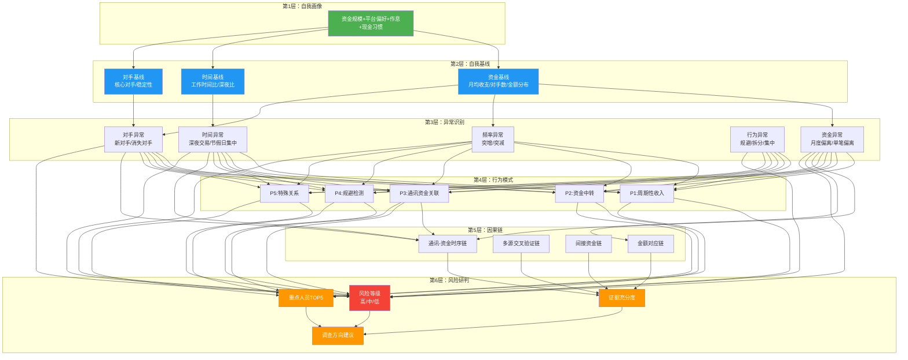

# 99-知识图谱 - 纪委监委初核报告（数据约束方案）

> 分析日期：2026-05-04 | 场景：通用知识探索（场景A）
> 汇总文档：所有递归解构的关系图谱

---

## 文档结构树

```
初核报告三阶解构-数据约束方案.md（主文档）
│
├── 01-自我基线-三阶解构.md
│   ├── 01-01-资金基线-三阶解构.md
│   ├── 01-02-时间基线-三阶解构.md（待生成）
│   └── 01-03-对手基线-三阶解构.md（待生成）
│
├── 02-异常识别-三阶解构.md
│   ├── 02-01-资金异常-三阶解构.md（待生成）
│   ├── 02-02-时间异常-三阶解构.md（待生成）
│   └── 02-03-频率异常-三阶解构.md（待生成）
│
├── 03-异常量化-三阶解构.md
│
├── 04-行为模式归类-三阶解构.md
│   ├── 04-01-P1周期性收入-三阶解构.md（待生成）
│   ├── 04-02-P2资金中转-三阶解构.md（待生成）
│   └── 04-03-P3通讯资金关联-三阶解构.md（待生成）
│
├── 05-因果链-三阶解构.md
│   ├── 05-01-通讯资金时序链-三阶解构.md（待生成）
│   └── 05-02-多源交叉验证链-三阶解构.md（待生成）
│
├── 06-风险研判-三阶解构.md
│   ├── 06-01-风险等级评估-三阶解构.md
│   └── 06-02-重点人员排序-三阶解构.md（待生成）
│
└── 99-知识图谱.md（本文件）
```

---

## 核心概念关系图



---

## 逻辑依赖关系

```
自我画像 ────────────────────────────────────────────────────→ 报告第1章
    │
    ↓（画像数据统计出基线）
自我基线 ────────────────────────────────────────────────────→ 报告第2章
    │
    ↓（基线作为参照判定异常）
异常识别 ────────────────────────────────────────────────────→ 报告第3章
    │
    ├────→（异常组合匹配模式）──→ 行为模式归类 ─────────────→ 报告第4章
    │                                         │
    ↓                                         ↓
异常量化 ──────────────────────────→ 因果链 ─────────────────→ 报告第5章
    │                                    │
    └────────────┬───────────────────────┘
                 ↓
           风险研判 ─────────────────────────────────────────→ 报告第6章
```

---

## 新增分析器与现有系统的关系

| 新增分析器 | 依赖的现有分析器 | 产出的新数据模型 | 写入报告的章节 |
|-----------|----------------|----------------|-------------|
| `BaselineAnalyzer` | 存取现识别(需标识)、频率分析(需对手统计) | `PersonBaseline` | 第2章：行为基线 |
| `PatternRecognizer` | 基线(阈值)、异常(信号)、频率(对手统计) | `PatternMatch` | 第4章：行为模式 |
| `TimelineAnalyzer` | 频率(对手统计)、话单数据 | `TimelineChain` | 第5章：关联证据 |
| `RiskAssessor` | 基线+异常+模式+时序链+交叉分析 | `RiskAssessment` | 第6章：研判结论 |

**执行顺序**：存取现(1)→频率(2)→特殊(3)→交叉(4)→重点收支(5)→大额追踪(6)→高级分析(7)→**基线(8)**→**模式(9)**→**时序(10)**→**研判(11)**

---

## 待深入分析清单

以下文档标记了✅但在本次分析中尚未展开（第2层/第3层递归）：

| 文档 | 待深入内容 | 优先级 |
|-----|-----------|-------|
| 01-02-时间基线 | 工作时间比/深夜比的统计方法和季节性处理 | 中 |
| 01-03-对手基线 | 核心对手识别/对手稳定性/新增对手频率 | 高 |
| 02-01-资金异常 | 月度收支偏离的详细检测算法 | 高 |
| 02-02-时间异常 | 深夜交易/非工作时间大额交易的检测逻辑 | 中 |
| 02-03-频率异常 | 突增突减/高频后消失的检测逻辑 | 中 |
| 04-01-P1周期性收入 | 详细的识别条件和匹配度算法 | 高 |
| 04-02-P2资金中转 | 大额转入→取现/转出的检测逻辑 | 高 |
| 04-03-P3通讯资金关联 | 通话→资金时序模式的详细算法 | 高 |
| 05-01-通讯资金时序链 | 滑动窗口+重复检测的详细算法 | 高 |
| 05-02-多源交叉验证链 | 多源一致性评估算法 | 中 |
| 06-02-重点人员排序 | 关联度评分算法 | 中 |

**停止条件**：当前已展开到第2层，关键算法逻辑和数据模型已清晰，足以支撑后续开发。剩余待深入文档可在开发过程中按需补充。

---

*知识图谱 - 纪委监委初核报告数据约束方案*
