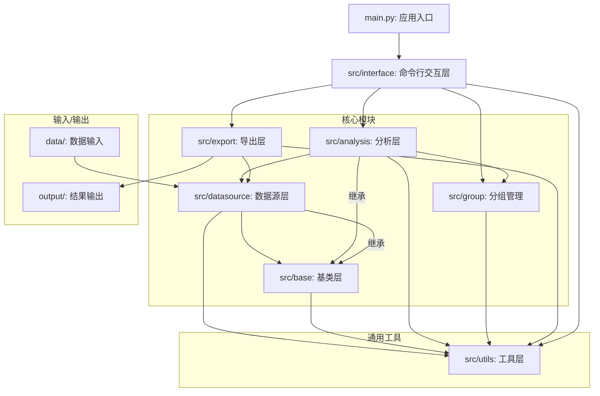

**`src/utils/config.py` 文件分析:**

*   **作用**: 这个文件定义了一个 `Config` 类，用于管理整个应用的配置。它会尝试从 `config.json` 文件加载配置，如果文件不存在，则使用一套默认配置。这个类允许通过点分割的字符串（如 `data_sources.bank.name_column`）来方便地获取和设置嵌套的配置项。
*   **包含的类**:
    *   `Config`:
        *   `__init__`: 初始化配置，加载或创建默认配置。
        *   `load`: 从 `config.json` 加载配置。
        *   `save`: 将当前配置保存到 `config.json`。
        *   `get`: 获取指定键值的配置。
        *   `set`: 设置指定键值的配置。
        *   `reset`: 重置为默认配置。
*   **依赖关系**:
    *   **项目内依赖**: 无。
    *   **外部依赖**: `json`, `os`, `logging`, `typing`。

**`src/utils/logger.py` 文件分析:**

*   **作用**: 这个文件提供了配置和获取日志记录器（logger）的功能。它可以同时将日志输出到控制台和日志文件，并对日志格式进行统一配置。
*   **包含的函数**:
    *   `setup_logger`: 根据传入的参数（名称、级别、日志文件路径、是否输出到控制台）来创建一个新的或配置一个已有的日志记录器。
    *   `get_default_logger`: 获取一个默认的日志记录器，如果不存在，则会创建一个以当前时间戳命名的日志文件。
*   **依赖关系**:
    *   **项目内依赖**: 无。
    *   **外部依赖**: `logging`, `os`, `sys`, `datetime`。

**`src/base/base_model.py` 文件分析:**

*   **作用**: 此文件定义了一个抽象基类 `BaseDataModel`，作为项目中所有数据模型的父类。这个基类使用 `pandas` 库，封装了加载数据（Excel/CSV）、验证数据（检查必需列、是否为空）、筛选数据等通用功能。它还通过抽象方法 `preprocess` 强制所有子类必须实现自己的数据预处理逻辑。
*   **包含的类**:
    *   `BaseDataModel(ABC)`:
        *   `__init__`: 初始化，可从文件路径或直接从 `DataFrame` 加载数据。
        *   `load_data`: 从 Excel 或 CSV 文件加载数据。
        *   `validate`: 验证数据，确保包含必要列且不为空。
        *   `preprocess`: 抽象方法，留给子类实现具体的数据预处理。
        *   提供多种数据筛选和统计方法，如 `filter_by_value`, `get_stats` 等。
*   **依赖关系**:
    *   **项目内依赖**: 无。
    *   **外部依赖**: `pandas`, `abc`, `logging`, `typing`。

**`src/base/base_analyzer.py` 文件分析:**

*   **作用**: 此文件定义了抽象基类 `BaseAnalyzer`，作为项目中所有具体分析类的父类。它在初始化时需要一个数据模型对象 (`data_model`)，并可选地接受一个群组管理器 (`group_manager`) 以支持按组分析。该基类提供了获取和导出分析结果（到Excel）、计算日期范围等通用功能，并通过抽象方法 `analyze` 强制所有子类必须实现其核心分析逻辑。
*   **包含的类**:
    *   `BaseAnalyzer(ABC)`:
        *   `__init__`: 初始化，接收一个数据模型和一个可选的群组管理器。
        *   `analyze`: 抽象方法，留给子类实现具体的分析逻辑。
        *   提供了按个人 (`analyze_by_person`) 和按组 (`analyze_by_group`) 进行分析的框架。
        *   `get_result`: 获取分析结果。
        *   `export_result`: 将分析结果导出为 Excel 文件。
        *   包含一些通用的计算函数，如 `calculate_date_range`。
*   **依赖关系**:
    *   **项目内依赖**:
        *   `BaseDataModel` (来自 `src/base/base_model.py`): 在构造函数中作为参数传入。
        *   `GroupManager` (推测来自 `src/group/group_manager.py`): 在构造函数中作为可选参数传入。
    *   **外部依赖**: `pandas`, `numpy`, `abc`, `logging`, `datetime`, `os`。

`base` 目录已分析完毕。接下来进入 `datasource` 目录，这里应该包含了对 `BaseDataModel` 的具体实现。

**`src/datasource/alipay_model.py` 文件分析:**

*   **作用**: 这是 `BaseDataModel` 的一个具体实现，专门用于处理支付宝的交易数据。它从配置文件 (`config.json`) 中读取支付宝数据对应的列名，并实现了 `preprocess` 方法来清洗和构建数据，例如转换日期和金额列的格式，并根据交易方向标志（或金额正负）创建独立的“收入金额”和“支出金额”列。
*   **包含的类**:
    *   `AlipayDataModel(BaseDataModel)`:
        *   `__init__`: 初始化模型，从配置中加载列名，并调用父类的初始化方法。
        *   `preprocess`: 实现了针对支付宝数据格式的预处理逻辑，包括日期转换、金额清洗、创建收入/支出列，并添加“数据来源”列。
        *   `add_income_expense_columns`: 填充收入和支出列的逻辑。
        *   提供了多种按本人、交易对手、收入/支出来筛选数据的方法。
*   **依赖关系**:
    *   **项目内依赖**:
        *   `src.base.BaseDataModel`: 继承自该类。
        *   `src.utils.config.Config`: 用于获取列名等配置。
    *   **外部依赖**: `pandas`, `numpy`, `datetime`, `typing`, `os`。

这是一个清晰的设计模式。我预计 `datasource` 目录下的其他模型文件（如 `bank_model.py`, `call_model.py`, `wechat_model.py`）也会遵循类似的结构。

**`src/datasource/bank_model.py` 文件分析:**

*   **作用**: 这是 `BaseDataModel` 的一个具体实现，专门用于处理银行交易数据。该模型的实现比支付宝模型更复杂，因为它需要兼容更多样的数据格式。例如，它可以将分散在“借方发生额”和“贷方发生额”两列的数据合并成统一的“交易金额”和“借贷标识”列。其核心功能之一是能够根据摘要/备注中的关键词以及是否存在交易对手方来区分“存取现”和“转账”这两种不同的交易类型。
*   **包含的类**:
    *   `BankDataModel(BaseDataModel)`:
        *   `__init__`: 与 `AlipayDataModel` 类似，加载列名、存取现关键词等配置。
        *   `preprocess`: 一个多步骤的预处理流程。它会统一借贷列、标准化数据类型、添加存取现标识、处理转账交易的收入和支出、并尝试识别银行名称。
        *   `add_cash_operation_flag`: 根据关键词（如'存'、'取'）和交易对手是否为空来识别存取现交易，并添加“存取现标识”列。
        *   `process_transfer_income_expense`: 为被识别为“转账”的交易计算收入和支出金额。
        *   `add_bank_name_column`: 添加银行名称列，必要时会从其他列中提取。
        *   同样提供了多种 `get_*_data` 方法用于获取不同类型的交易数据（转账、现金、存款、取款）。
*   **依赖关系**:
    *   **项目内依赖**:
        *   `src.base.BaseDataModel`: 继承自该类。
        *   `src.utils.config.Config`: 用于获取配置信息。
    *   **外部依赖**: `pandas`, `numpy`, `datetime`, `re`, `typing`, `os`。

这个模型表明，处理银行流水数据需要比处理支付宝数据更复杂的清洗逻辑。

**`src/datasource/call_model.py` 文件分析:**

*   **作用**: 这是 `BaseDataModel` 的一个具体实现，专门用于处理通话详单（话单）数据。它负责解析通话记录，识别通话类型（如主叫、被叫、短信），并为不同类型的记录创建独立的计数列。
*   **包含的类**:
    *   `CallDataModel(BaseDataModel)`:
        *   `__init__`: 加载列名和通话类型标识符（例如，'主叫'、'被叫'）的配置。
        *   `preprocess`: 将日期时间和通话时长列转换为正确的格式，并调用 `add_call_type_columns` 来分类记录。
        *   `add_call_type_columns`: 根据“呼叫类型”列的值，创建“主叫次数”、“被叫次数”和“短信次数”等新列。
        *   包含了多种 `get_*` 方法，用于按本人、对方、通话类型等条件筛选数据。
*   **依赖关系**:
    *   **项目内依赖**:
        *   `src.base.BaseDataModel`: 继承自该类。
        *   `src.utils.config.Config`: 用于获取配置。
    *   **外部依赖**: `pandas`, `numpy`, `datetime`, `typing`, `os`。

**`src/datasource/wechat_model.py` 文件分析:**

*   **作用**: 这是 `BaseDataModel` 的一个具体实现，专门用于处理微信交易数据。它的结构与 `AlipayDataModel` 非常相似，同样是定义了微信数据相关的列名，并实现了相应的预处理逻辑。
*   **包含的类**:
    *   `WeChatDataModel(BaseDataModel)`:
        *   `__init__`: 加载微信数据相关的列名配置。
        *   `preprocess`: 清洗和标准化日期、金额、余额等列，并调用 `add_income_expense_columns`。
        *   `add_income_expense_columns`: 创建“收入金额”和“支出金额”列。它会优先使用收支标识列（如'入'/'出'），如果标识列无效，则会根据交易金额的正负来判断。
        *   包含与其他金融数据模型类似的各种 `get_*` 方法用于数据筛选。
*   **依赖关系**:
    *   **项目内依赖**:
        *   `src.base.BaseDataModel`: 继承自该类。
        *   `src.utils.config.Config`: 用于获取配置。
    *   **外部依赖**: `pandas`, `numpy`, `datetime`, `typing`, `os`。

**`analysis` 目录文件列表:** `__init__.py`, `alipay_analyzer.py`, `bank_analyzer.py`, `call_analyzer.py`, `comprehensive_analyzer.py`, `wechat_analyzer.py`.

这个目录结构与 `datasource` 目录相呼应，每个数据模型都有一个对应的分析器，外加一个综合分析

`src/analysis/alipay_analyzer.py` 文件分析完毕。

**`src/analysis/alipay_analyzer.py` 文件分析:**

*   **作用**: 该文件实现了 `BaseAnalyzer`，用于对支付宝数据进行分析。其主要功能是计算交易频率统计。它通过将交易按本人和交易对手进行分组，来计算总收入、总支出、交易次数和交易时间跨度。
*   **包含的类**:
    *   `AlipayAnalyzer(BaseAnalyzer)`:
        *   `__init__`: 初始化分析器，并确保传入的 `data_model` 是 `AlipayDataModel` 类型。
        *   `analyze`: 主要的分析方法。它会遍历 `AlipayDataModel` 中的不同数据源（例如，不同的Excel文件），并对每个源进行分析。目前主要支持“频率”分析。结果保存在一个以数据源名称为键的字典中。
        *   `_analyze_for_source`: 一个辅助方法，用于对单个数据源执行分析。
        *   `analyze_frequency`: 这是核心分析逻辑。它接收一个 `DataFrame`，按“本方姓名”和“对方姓名”进行分组，然后聚合计算收支总额和交易次数，并计算每对交易方之间的交易时间跨度。
        *   `get_top_transactions`: 一个用于按金额获取前 N 条交易记录的工具函数。
*   **依赖关系**:
    *   **项目内依赖**:
        *   `src.base.BaseAnalyzer`: 继承自该类。
        *   `src.datasource.AlipayDataModel`: 在构造函数中接收该类的实例以访问数据。
        *   `src.group.GroupManager`: 可选地接收该类的实例以进行分组分析（尽管在当前 `analyze` 方法中未完全使用）。
    *   **外部依赖**: `pandas`, `numpy`, `typing`, `datetime`。

**`src/analysis/bank_analyzer.py` 文件分析:**

*   **作用**: 该文件实现了 `BaseAnalyzer`，用于对银行数据进行分析。它比支付宝分析器包含更专门化的分析功能，拥有独立的存取现分析和转账频率分析方法。这也反映了 `BankDataModel` 中所做的更精细的数据预处理工作。
*   **包含的类**:
    *   `BankAnalyzer(BaseAnalyzer)`:
        *   `__init__`: 确保传入的 `data_model` 是 `BankDataModel` 类型。
        *   `analyze`: 主要的分析入口。它可以运行不同类型的分析：“cash”（存取现分析）、“frequency”（转账频率分析）或“all”（全部）。它会将任务分派给具体的分析方法。
        *   `_analyze_for_source`: 在单个数据源上运行分析的辅助方法。
        *   `analyze_cash_operations`: 筛选出在 `BankDataModel` 中被标记为“存现”或“取现”的交易。然后按本人和操作类型进行分组，以计算总次数、总金额、平均金额和日期范围。
        *   `analyze_frequency`: 与 `AlipayAnalyzer` 中的类似，但它首先筛选数据，只包含“转账”交易，排除了已单独分析的存取现操作，然后再计算频率统计。
        *   `get_top_transactions`: 获取前N笔交易的工具函数。
        *   `get_top_cash_transactions_by_source_and_type`: 一个更具体的工具函数，用于获取最高的存取现交易。
*   **依赖关系**:
    *   **项目内依赖**:
        *   `src.base.BaseAnalyzer`: 继承自该类。
        *   `src.datasource.BankDataModel`: 构造函数中需要该类的实例。
        *   `src.group.GroupManager`: 可选依赖。
    *   **外部依赖**: `pandas`, `numpy`, `typing`, `datetime`。

**`src/analysis/call_analyzer.py` 文件分析:**

*   **作用**: 该文件实现了 `BaseAnalyzer`，用于对话单数据进行分析。其主要功能是分析通话频率，总结用户与联系人之间的互动情况。
*   **包含的类**:
    *   `CallAnalyzer(BaseAnalyzer)`:
        *   `__init__`: 确保传入的 `data_model` 是 `CallDataModel` 类型。
        *   `analyze`: 主要的分析方法。它会遍历不同的数据源，并对每个源调用 `analyze_call_frequency` 方法。
        *   `_analyze_for_source`: 在单个数据源上运行分析的辅助方法。
        *   `analyze_call_frequency`: 这是核心分析逻辑。它将通话记录按本人（`本方姓名`）、对方姓名（`对方姓名`）和对方号码（`对方号码`）进行分组。然后，它计算总通话时长、总通话次数和通信的时间跨度。它还巧妙地聚合了对方单位和职务等关联信息（如果存在）。
        *   `get_most_frequent_calls`: 用于查找最常通话联系人的工具函数。
        *   `get_longest_duration_calls`: 用于查找总通话时长最长联系人的工具函数。
*   **依赖关系**:
    *   **项目内依赖**:
        *   `src.base.BaseAnalyzer`: 继承自该类。
        *   `src.datasource.CallDataModel`: 构造函数中需要该类的实例。
        *   `src.group.GroupManager`: 可选依赖。
    *   **外部依赖**: `pandas`, `numpy`, `typing`, `datetime`。

**`src/analysis/wechat_analyzer.py` 文件分析:**

*   **作用**: 该文件实现了 `BaseAnalyzer`，用于处理微信交易数据。如我所料，它的结构和逻辑与 `AlipayAnalyzer` 几乎完全相同，都是通过按本人和交易对手进行分组，来执行交易频率分析。
*   **包含的类**:
    *   `WeChatAnalyzer(BaseAnalyzer)`:
        *   `__init__`: 确保传入的 `data_model` 是 `WeChatDataModel` 类型。
        *   `analyze`: 主要的分析入口，调用 `analyze_frequency`。
        *   `analyze_frequency`: 核心分析逻辑，与 `AlipayAnalyzer` 中的逻辑相同，按本人和对方分组计算总收支、交易次数和时间跨度。
        *   `get_top_transactions`: 获取前 N 笔交易的工具函数。
*   **依赖关系**:
    *   **项目内依赖**:
        *   `src.base.BaseAnalyzer`: 继承自该类。
        *   `src.datasource.WeChatDataModel`: 构造函数中需要该类的实例。
        *   `src.group.GroupManager`: 可选依赖。
    *   **外部依赖**: `pandas`, `numpy`, `typing`, `datetime`。

`AlipayAnalyzer` 和 `WeChatAnalyzer` 之间的高度相似性表明，未来或许可以通过创建一个更通用的金融交易分析器（如 `FinancialTransactionAnalyzer`）来重用代码。

**`src/analysis/comprehensive_analyzer.py` 文件分析:**

*   **作用**: 这是一个高级的“编排器”类。它的职责是接收各种数据模型（银行、话单等），运行它们各自对应的分析器，然后将分析结果合并成一个单一的、全面的综合报告。其核心逻辑是基于共同的标识符——即“本方姓名”和“对方姓名”——来合并数据。
*   **包含的类**:
    *   `ComprehensiveAnalyzer`:
        *   `__init__`: 初始化所有具体的分析器（`BankAnalyzer`, `CallAnalyzer` 等）。
        *   `analyze`: 这是主要方法。
            1.  它为每种可用的数据类型（银行、话单、微信、支付宝）运行频率分析。
            2.  它将其中一种数据类型（`base_source`）的频率分析结果作为基础 `DataFrame`。
            3.  然后，它遍历其他分析结果，并以 `left merge` 的方式合并到基础 `DataFrame` 上。合并的键是“本方姓名”和“对方姓名”。这个过程将同一个交易对手在不同平台上的交易和通话统计数据整合到一起。
            4.  最终结果是一个宽表 `DataFrame`，每一行都展示了与某个特定对手方的所有往来信息，包括银行、微信、支付宝的总交易额和通话统计等。
        *   `_get_chinese_data_type_name`: 获取数据类型中文名的辅助函数。
        *   `_format_comprehensive_result`: 通过选择和重命名列来格式化最终的合并结果，以生成清晰的报告。
*   **依赖关系**:
    *   **项目内依赖**:
        *   它几乎依赖于项目的所有主要组件：
        *   `src.datasource` 下的所有 `DataModel` 类。
        *   `src.analysis` 下的所有 `Analyzer` 类。
        *   `src.group.GroupManager`: 可选依赖。
    *   **外部依赖**: `pandas`, `numpy`, `typing`, `logging`, `datetime`。

`analysis` 目录分析完毕。现在我们来看 `group` 目录。

**`src/group/group_manager.py` 文件分析:**

*   **作用**: 这个类提供了一种管理人员分组的方法。一个“分组”就是一个命名的成员列表（例如，名为“家庭”的分组可能包含["成员A", "成员B"]）。分析器可以使用这个管理器来对整个群组进行分析，而不仅仅是针对个人。它支持创建、删除和修改分组，以及从JSON或CSV文件加载/保存分组定义。
*   **包含的类**:
    *   `GroupManager`:
        *   `__init__`: 使用分组字典进行初始化。
        *   `add_group`, `remove_group`, `add_member`, `remove_member`: 用于基本分组操作的方法。
        *   `get_group`, `get_all_groups`: 用于检索分组信息的方法。
        *   `from_file`: 从文件加载分组定义。它可以处理JSON（组名到成员列表的字典）和CSV（包含'group'和'member'列）。
        *   `to_file`: 将当前分组保存到文件。
*   **依赖关系**:
    *   **项目内依赖**: 无。
    *   **外部依赖**: `pandas`, `json`, `logging`, `os`, `typing`。

**`src/export/excel_exporter.py` 文件分析:**

*   **作用**: 这个类负责从分析结果中创建一个精美的Excel报告。它不仅仅是简单地转存 `DataFrame`，而是创建一个包含多个工作表的工作簿，其中包括格式化的表格、自动调整的列宽，以及额外的汇总和原始数据表。
*   **包含的类**:
    *   `ExcelExporter`:
        *   `__init__`: 设置输出目录。
        *   `export`: 主要的导出方法。
            1.  接收分析结果字典（来自 `ComprehensiveAnalyzer` 等）和原始数据模型。
            2.  将 `analysis_results` 中的每个 `DataFrame` 写入一个单独的、名称经过清理的工作表。
            3.  使用 `data_models` 来添加额外的上下文信息。例如，它会利用通话记录数据来为其他分析表添加“对方单位”列。
            4.  对银行数据有特殊的处理逻辑，会调用 `add_summary_sheets` 和 `export_raw_bank_data` 添加额外的汇总表和原始数据表。
        *   `add_summary_sheets`: 从银行数据中为存取现和转账操作创建专门的汇总表。
        *   `export_raw_bank_data`: 导出原始的银行数据，并将其拆分为转账、存款和取款三个独立的工作表。
        *   `_clean_sheet_name`, `_set_column_widths`, `_format_sheet`, `_add_conditional_formatting`: 这些是用于美化Excel输出的辅助方法，处理诸如工作表名称限制、列宽、表头格式以及应用条件格式（如色阶）等事务。
*   **依赖关系**:
    *   **项目内依赖**:
        *   `src.base.BaseDataModel` 和 `src.datasource.BankDataModel`: 用于类型提示和访问原始数据以创建汇总报告。
    *   **外部依赖**: `pandas`, `os`, `logging`, `typing`, `xlsxwriter`, `datetime`, `numpy`。

**`src/export/word_exporter.py` 文件分析:**

*   **作用**: 这个类旨在生成一份叙述性的、人类可读的 `.docx` Word 格式报告。与 `ExcelExporter` 展示原始数据和表格不同，该类将分析结果合成为描述性的段落，并辅以摘要表格。整个报告的结构是以“个人”为核心进行组织的。
*   **包含的类**:
    *   `WordExporter`:
        *   `generate_comprehensive_report`: 这是主要的公开方法，负责编排整个文档的创建过程。
            1.  它首先从所有数据源中识别出所有唯一的个人（`本方姓名`）。
            2.  然后生成一个全局的基本信息摘要部分 (`generate_global_basic_info`)。
            3.  接着，它遍历每一个人，为他们创建详细的分析章节。
            4.  对于每一个人，它会调用特定的方法（如 `generate_person_bank_analysis`, `generate_person_payment_analysis`）来为银行、微信、通话等每种数据类型生成描述性文本和摘要表格。
            5.  最后，它调用 `generate_comprehensive_cross_analysis_section` 方法，使用 `ComprehensiveAnalyzer` 的结果来添加综合交叉分析部分。
        *   `generate_person_*_analysis`: 这些方法接收特定数据类型的分析器，筛选出当前分析对象的数据，然后生成摘要段落和表格。例如，`generate_person_bank_analysis` 会分别讨论转账活动和存取现操作。
        *   `_generate_*_summary_paragraph`: 这些是辅助方法，负责执行计算（如总收入、净流水、交易最频繁的月份）并将结果格式化为描述性的文本段落。报告的“叙述”部分就是在这里构建的。
        *   `_add_df_to_doc`: 一个将 pandas DataFrame 转换为 Word 文档中格式化表格的工具函数。
*   **依赖关系**:
    *   **项目内依赖**:
        *   它使用所有传入 `generate_comprehensive_report` 的 `DataModel` 和 `Analyzer` 实例。
    *   **外部依赖**: `pandas`, `os`, `logging`, `typing`, `python-docx`。

**`interface` 目录文件列表:** `__init__.py`, `base_interface.py`, `cli_interface.py`, `cli_interface_export.py`, `cli_interface_group.py`

是应用的命令行界面。

**`src/interface/base_interface.py` 文件分析:**

*   **作用**: 这个文件定义了一个 `BaseInterface` 类，它为构建基于文本的命令行界面（CLI）提供了一套可重用的组件。它封装了常见的UI任务，如显示菜单、获取经过验证的用户输入、请求确认以及以格式化的方式显示数据。
*   **包含的类**:
    *   `BaseInterface`:
        *   `display_menu`: 显示一个带编号的选项列表，并获取用户的选择。
        *   `get_input`: 一个健壮的方法，用于从用户那里获取一行文本，支持默认值和自定义验证器。
        *   `get_path_input`: `get_input` 的一个专门版本，用于获取文件或目录路径，并可选择检查路径是否存在。
        *   `get_multiple_choice`: 允许用户从列表中选择一个或多个项目。
        *   `display_data`: 以可读的格式在控制台打印一个 pandas DataFrame。
        *   `confirm`, `display_error`, `display_success` 等: 用于向用户显示格式化消息的辅助方法。
*   **依赖关系**:
    *   **项目内依赖**:
        *   `src.utils.logger.setup_logger`: 如果没有提供日志记录器，则用它来设置一个。
    *   **外部依赖**: `os`, `logging`, `typing`, `pandas`。

这个基类为实际的CLI逻辑提供了所有的构建模块。

**`src/interface/cli_interface_group.py` 文件分析:**

*   **作用**: 这个文件包含了实现命令行界面中“分组管理”部分功能的函数。它本身不是一个类，而是一系列旨在成为主 `CliInterface` 类一部分的方法。这些方法使用 `BaseInterface` 的辅助函数（如 `display_menu`, `get_input`）与用户交互，并调用 `GroupManager` 的方法来执行实际的逻辑（创建、编辑、删除分组等）。
*   **包含的函数 (作为 `CliInterface` 的方法):**
    *   `manage_groups_menu`: 显示分组管理的主菜单，并根据用户选择调用其他函数。
    *   `create_group`: 引导用户创建一个新分组。它会从已加载的数据模型中获取所有已知人员的列表，作为潜在成员供用户选择。
    *   `edit_group`: 允许添加/删除成员或重命名现有分组。
    *   `delete_group`: 删除一个分组。
    *   `view_groups`: 显示所有现有的分组及其成员。
    *   `import_groups`: 询问用户文件路径，并使用 `group_manager.from_file` 来加载分组。
    *   `export_groups`: 询问用户文件路径，并使用 `group_manager.to_file` 来保存分组。
*   **依赖关系**:
    *   **项目内依赖**:
        *   它被设计为继承自 `BaseInterface` 的类的一部分（使用了 `self.display_menu` 等方法）。
        *   它使用 `src.group.GroupManager` 来管理分组数据。
        *   它访问 `self.data_models` 字典以获取人员列表。
    *   **外部依赖**: 无直接依赖，但依赖于 `BaseInterface` 和 `GroupManager` 的依赖项。

**`src/interface/cli_interface_export.py` 文件分析:**

*   **作用**: 这个文件包含了CLI中“导出”和“查看结果”部分的功能。与分组管理文件一样，它是一系列旨在成为主 `CliInterface` 一部分的方法。它使用 `ExcelExporter` 和 `WordExporter` 来执行实际的文件生成，并提供了一个详细的文本用户界面（TUI），用于直接在终端中浏览分析结果。
*   **包含的函数 (作为 `CliInterface` 的方法):**
    *   `export_results_menu`: 导出的主菜单。
    *   `export_to_excel`: 提示用户输入文件名，并调用 `excel_exporter.export`。
    *   `generate_word_report`: 提示用户输入报告标题，并调用 `word_exporter.generate_comprehensive_report`。
    *   `view_results_menu`: 显示所有已生成的分析结果列表（存储在 `self.analysis_results` 中的 `DataFrame`）。
    *   `view_result`: 单个结果 `DataFrame` 的详细视图。它使用 `display_data`，然后提供排序或筛选数据的选项。
    *   `sort_result`: 让用户选择一列和排序顺序，然后显示排序后的 `DataFrame`。
    *   `filter_result`: 让用户选择一列并筛选其值（对数字和文本列的处理方式不同）。
*   **依赖关系**:
    *   **项目内依赖**:
        *   被设计为继承自 `BaseInterface` 的类的一部分。
        *   `src.export.ExcelExporter` 和 `src.export.WordExporter`: 它使用这些类的实例来执行导出操作。
        *   依赖于 `self.analysis_results`（一个DataFrame字典）和 `self.data_models` 的存在。
    *   **外部依赖**: `os`, `pandas`, `datetime`, `logging`, `typing`。

**`src/interface/cli_interface.py` 文件分析:**

*   **作用**: 这是将所有组件整合在一起，创建交互式命令行应用程序的主类。它继承自 `BaseInterface`，并使用来自 `cli_interface_group.py` 和 `cli_interface_export.py` 的方法（这些方法在 `__init__` 中被绑定到其实例上）。它持有所有数据模型、分析器和导出器的实例，并编排了主要的工作流程：加载数据 -> 运行分析 -> 导出/查看结果。
*   **包含的类**:
    *   `CommandLineInterface(BaseInterface)`:
        *   `__init__`: 初始化所有必要的组件：数据模型字典、分组管理器、分析器字典、结果字典和导出器。它还动态地将其他 `cli_interface_*` 文件中的方法绑定到自身。
        *   `start`: 驱动应用程序的主循环，显示主菜单并处理用户选择。
        *   `load_data`: 包含加载数据的逻辑，调用 `auto_load_all_data`。
        *   `auto_load_all_data`: 扫描 `data` 目录下的Excel文件，尝试使用 `identify_data_type` 识别每个文件的数据类型，然后将其加载到相应的数据模型中（`load_specific_data`）。它支持合并多个相同类型的文件。
        *   `identify_data_type`: 一个简单但有效的启发式方法，根据关键列名的存在来猜测数据类型。
        *   `_initialize_analyzers`: 在加载或更改数据时（重新）创建分析器实例，确保它们始终拥有最新的数据。
        *   `run_analysis_menu`: 向用户呈现一个菜单，供其选择要运行的分析（例如，银行分析、综合分析）。
        *   `_run_analysis_by_source`: 一个通用的辅助函数，用于运行特定的分析，处理用户选择数据源的交互。
        *   `run_comprehensive_analysis`: 用于运行综合分析并存储其结果的处理程序。
*   **依赖关系**:
    *   **项目内依赖**: 这个类是中心枢纽，几乎依赖于 `src` 目录下的所有其他模块。
        *   继承自 `src.interface.base_interface.BaseInterface`。
        *   导入并使用 `src.interface.cli_interface_group` 和 `src.interface.cli_interface_export` 中的函数。
        *   `src.datasource` 下的所有 `DataModel` 类。
        *   `src.group.GroupManager`。
        *   `src.analysis` 下的所有 `Analyzer` 类。
        *   `src.export` 下的两个 `Exporter` 类。
        *   `src.utils.config.Config`。
    *   **外部依赖**: `os`, `logging`, `typing`, `pandas`, `datetime`, `traceback`。

**`main.py` 文件分析:**

*   **作用**: 这是整个应用的入口点。它的职责非常简单：解析命令行参数（用于配置日志）、设置主日志记录器、创建 `CommandLineInterface` 类的实例，然后启动它。代码还包含了一个顶层的 `try...except` 块，用于捕获任何未处理的异常，在退出前将其记录下来。
*   **包含的函数**:
    *   `parse_args`: 使用 `argparse` 模块来处理命令行标志，例如用于详细日志输出的 `-v`。
    *   `main`: 主执行函数。负责设置日志，实例化 `CommandLineInterface` 并调用其 `start()` 方法来启动程序。
*   **依赖关系**:
    *   **项目内依赖**:
        *   `src.utils.logger.setup_logger`: 用于初始化日志系统。
        *   `src.interface.CommandLineInterface`: 应用的主类。
    *   **外部依赖**: `os`, `sys`, `argparse`, `logging`。

---

## **项目架构文档**

### 1. 项目架构梳理

本项目采用经典的分层架构设计，结构清晰，职责分明。核心代码位于 `src` 目录中，其内部结构和数据流如下：

**数据流说明:**

1.  **启动**: `main.py` 作为程序入口，初始化并启动 `CommandLineInterface`。
2.  **用户交互**: `src/interface` 模块负责接收用户指令，例如加载数据、执行分析或导出报告。
3.  **数据加载**: 当用户选择加载数据时，`interface` 会调用 `src/datasource` 中的具体数据模型（如 `BankDataModel`），从 `data/` 目录读取原始 `xlsx` 文件。
4.  **数据预处理**: `datasource` 中的每个模型都继承自 `src/base/BaseDataModel`，在加载数据后会自动进行预处理（如数据清洗、格式转换、添加计算列）。
5.  **数据分析**: 当用户选择执行分析时，`interface` 会调用 `src/analysis` 中对应的分析器（如 `BankAnalyzer`）。分析器接收预处理好的数据模型，执行统计和分析逻辑。`ComprehensiveAnalyzer` 则负责整合多个分析器的结果，进行交叉分析。
6.  **结果导出**: 当用户选择导出时，`interface` 会调用 `src/export` 中的导出器（`ExcelExporter` 或 `WordExporter`），将 `analysis` 层生成的 `DataFrame` 结果格式化为美观的 `xlsx` 或 `docx` 文件，并保存到 `output/` 目录。
7.  **辅助模块**: `src/utils` 提供配置和日志等通用功能，`src/group` 提供人员分组管理功能，它们被其他所有模块按需调用。

### 2. 文件夹作用说明

*   **`data/`**: 存放原始数据文件（`.xlsx` 格式）。
*   **`output/`**: 存放程序生成的分析结果文件（`.xlsx`, `.docx`）。
*   **`src/`**: 项目的核心源代码。
    *   **`analysis/`**: 包含所有数据分析逻辑。每个分析器对应一种数据源，此外还有一个用于综合分析的 `comprehensive_analyzer.py`。
    *   **`base/`**: 定义了项目的基础抽象类，如 `BaseDataModel` 和 `BaseAnalyzer`，为上层模块提供了统一的接口和可重用的功能。
    *   **`datasource/`**: 负责数据的加载和预处理。每个 `model.py` 文件对应一种特定的数据源（银行、话单等）。
    *   **`export/`**: 负责将分析结果导出为最终文件。`excel_exporter.py` 用于生成表格，`word_exporter.py` 用于生成叙述性报告。
    *   **`group/`**: 提供人员分组管理功能。
    *   **`interface/`**: 实现程序的命令行用户界面（CLI），处理用户输入和流程控制。
    *   **`utils/`**: 包含通用工具类，如配置管理 (`config.py`) 和日志设置 (`logger.py`)。

### 3. & 4. 文件、类、函数及依赖关系详解

#### **根目录**

*   **`main.py`**
    *   **作用**: 程序主入口。
    *   **函数**:
        *   `parse_args()`: 解析命令行参数。
        *   `main()`: 初始化日志，实例化并启动 `CommandLineInterface`。
    *   **依赖**: `src.interface.CommandLineInterface`, `src.utils.logger.setup_logger`。

#### **`src/utils` - 工具层**

*   **`config.py`**
    *   **作用**: 管理 `config.json` 配置文件。
    *   **类**: `Config`，提供加载、保存、获取、设置配置项的功能。
    *   **依赖**: 无项目内依赖。
*   **`logger.py`**
    *   **作用**: 设置日志记录器。
    *   **函数**: `setup_logger`, `get_default_logger`。
    *   **依赖**: 无项目内依赖。

#### **`src/base` - 基类层**

*   **`base_model.py`**
    *   **作用**: 定义所有数据模型的抽象基类。
    *   **类**: `BaseDataModel(ABC)`
        *   **主要功能**: 封装了通用的数据加载（pandas）、验证、筛选和预处理流程。
        *   **核心方法**: `__init__`, `load_data`, `validate`, `preprocess` (抽象方法)。
    *   **依赖**: 无项目内依赖。
*   **`base_analyzer.py`**
    *   **作用**: 定义所有分析器的抽象基类。
    *   **类**: `BaseAnalyzer(ABC)`
        *   **主要功能**: 封装了通用的分析流程，如按人/按组分析、结果获取和导出。
        *   **核心方法**: `__init__`, `analyze` (抽象方法), `get_result`, `export_result`。
    *   **依赖**: 构造函数中接收 `BaseDataModel` 和 `GroupManager` 实例。

#### **`src/datasource` - 数据源层**

*   **`alipay_model.py`**, **`wechat_model.py`**, **`bank_model.py`**, **`call_model.py`**
    *   **作用**: 分别对应支付宝、微信、银行和话单四种数据的具体实现。
    *   **类**: `AlipayDataModel(BaseDataModel)`, `WeChatDataModel(BaseDataModel)`, `BankDataModel(BaseDataModel)`, `CallDataModel(BaseDataModel)`。
        *   **共同点**: 都继承自 `BaseDataModel`，并在 `__init__` 中从 `Config` 加载各自的列名配置。
        *   **核心实现**: 每个类都实现了 `preprocess` 方法，用于针对特定数据格式进行清洗（如日期转换、金额处理）和特征工程（如为交易数据添加“收入/支出”列，为话单数据添加“主叫/被叫次数”列）。`BankDataModel` 的逻辑最复杂，包含了区分“存取现”和“转账”的逻辑。
    *   **依赖**:
        *   继承: `src.base.BaseDataModel`。
        *   使用: `src.utils.config.Config`。

#### **`src/analysis` - 分析层**

*   **`alipay_analyzer.py`**, **`wechat_analyzer.py`**, **`bank_analyzer.py`**, **`call_analyzer.py`**
    *   **作用**: 分别对上述四种数据进行具体的统计分析。
    *   **类**: `AlipayAnalyzer(BaseAnalyzer)`, `WeChatAnalyzer(BaseAnalyzer)`, `BankAnalyzer(BaseAnalyzer)`, `CallAnalyzer(BaseAnalyzer)`。
        *   **共同点**: 都继承自 `BaseAnalyzer`，接收对应的 `DataModel` 实例。
        *   **核心实现**: 实现 `analyze` 方法，调用各自的核心分析函数（如 `analyze_frequency`）。
            *   `Alipay/WeChatAnalyzer`: 按“本方姓名”和“对方姓名”分组，统计交易次数、总收支、时间跨度。
            *   `BankAnalyzer`: 分别对“转账”和“存取现”进行频率和汇总分析。
            *   `CallAnalyzer`: 按“本方姓名”和“对方号码”分组，统计通话次数、总时长、时间跨度等。
    *   **依赖**:
        *   继承: `src.base.BaseAnalyzer`。
        *   使用: `src.datasource` 中对应的 `DataModel`，以及 `src.group.GroupManager`。
*   **`comprehensive_analyzer.py`**
    *   **作用**: 进行综合分析，将不同来源的数据关联起来。
    *   **类**: `ComprehensiveAnalyzer`
        *   **主要功能**: 初始化所有单一分析器。其核心 `analyze` 方法会运行所有分析器的频率分析，然后以一种数据源为基准，通过 `(本方姓名, 对方姓名)` 作为 `key`，将其他数据源的分析结果 `left merge` 进来，形成一个宽表。
    *   **依赖**: 使用 `src.analysis` 和 `src.datasource` 中的所有主要类。

#### **`src/group` - 分组管理**

*   **`group_manager.py`**
    *   **作用**: 管理人员分组。
    *   **类**: `GroupManager`
        *   **主要功能**: 提供创建、编辑、删除、查询分组的功能，支持从文件导入和导出分组信息。
    *   **依赖**: 无项目内依赖。

#### **`src/export` - 导出层**

*   **`excel_exporter.py`**
    *   **作用**: 将分析结果导出为格式化的 Excel 文件。
    *   **类**: `ExcelExporter`
        *   **主要功能**: 接收分析结果字典，将每个结果写入一个独立的、格式精美的 Sheet。能自动调整列宽、美化表头，并为银行数据额外生成汇总和原始数据表。
    *   **依赖**: `src.base.BaseDataModel`, `src.datasource.BankDataModel`。
*   **`word_exporter.py`**
    *   **作用**: 生成叙述性的 Word 分析报告。
    *   **类**: `WordExporter`
        *   **主要功能**: 接收所有分析器和数据模型，以“人”为核心，自动生成包含描述性段落和关键表格的 `.docx` 报告。它将数值结果转化为易于理解的文字描述。
    *   **依赖**: 依赖所有 `Analyzer` 和 `DataModel` 实例来获取数据和分析结果。

#### **`src/interface` - 交互层**

*   **`base_interface.py`**
    *   **作用**: 提供构建命令行界面的可重用基础组件。
    *   **类**: `BaseInterface`，包含显示菜单、获取输入、显示数据等方法。
    *   **依赖**: `src.utils.logger.setup_logger`。
*   **`cli_interface_group.py`**, **`cli_interface_export.py`**
    *   **作用**: 这两个文件中的函数被动态地注入到 `CommandLineInterface` 类中，分别负责处理“分组管理”和“导出与查看结果”的菜单逻辑。
    *   **依赖**: `BaseInterface`, `GroupManager`, `ExcelExporter`, `WordExporter`。
*   **`cli_interface.py`**
    *   **作用**: 项目的“大脑”和用户交互的总控制器。
    *   **类**: `CommandLineInterface(BaseInterface)`
        *   **主要功能**: 继承 `BaseInterface`，组合所有其他模块的功能。它管理着程序的状态（加载了哪些数据、分析结果是什么），并根据用户的选择驱动整个“加载数据 -> 分析 -> 导出”的流程。其 `auto_load_all_data` 和 `identify_data_type` 方法实现了数据的自动识别和加载，是实现易用性的关键。
    *   **依赖**: 几乎依赖项目中 `src` 目录下的所有模块。